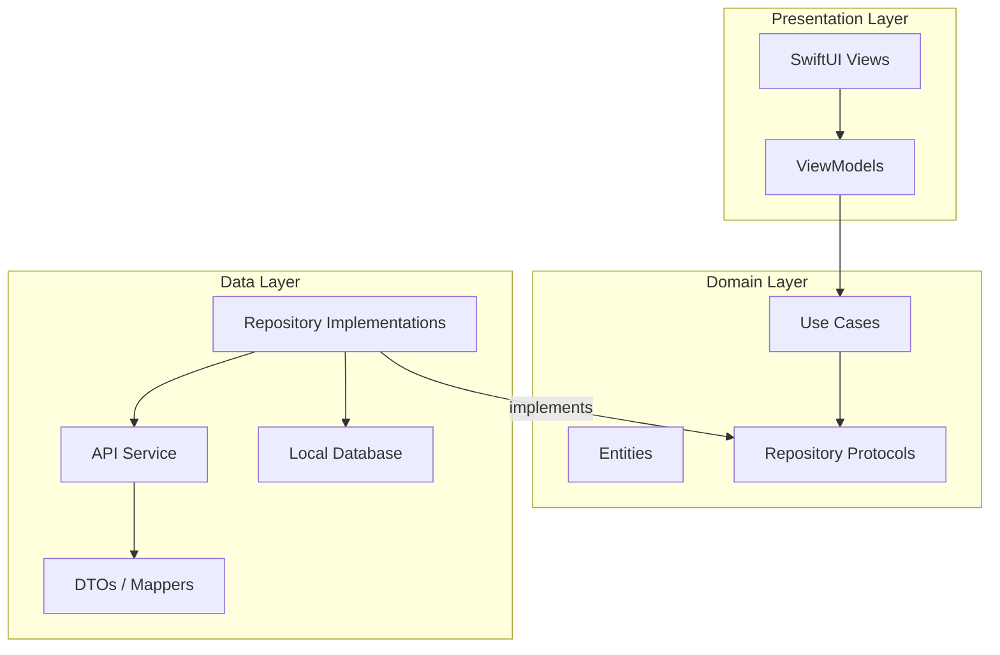
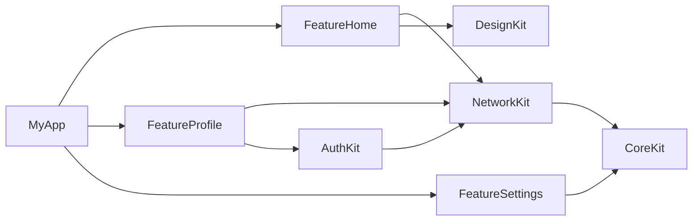

# 📱 Senior iOS Developer — Interview Q&A Guide

> Covers: Swift Concurrency, Combine, GitHub Actions CI/CD, Git, BLE/WiFi, Firebase Crashlytics, Objective-C Basics, SwiftUI Navigation, XCTest, and Xcode Instruments.

---

## 1. Swift Concurrency — Actors & async/await

### Q1: What is `async/await` in Swift and why was it introduced?

**Answer:**
`async/await` is Swift's structured concurrency model introduced in Swift 5.5. It replaces completion handler (callback) based asynchronous code with linear, readable code.

**Before (Callback Hell):**
```swift
func fetchUser(completion: @escaping (User?) -> Void) {
    URLSession.shared.dataTask(with: url) { data, _, error in
        guard let data = data else { completion(nil); return }
        let user = try? JSONDecoder().decode(User.self, from: data)
        DispatchQueue.main.async {
            completion(user)
        }
    }.resume()
}
```

**After (async/await):**
```swift
func fetchUser() async throws -> User {
    let (data, _) = try await URLSession.shared.data(from: url)
    return try JSONDecoder().decode(User.self, from: data)
}
```

**Key benefits:**
- Eliminates nested callbacks (pyramid of doom)
- Compiler enforces error handling with `try`
- Code reads top-to-bottom like synchronous code
- No more forgetting to call `completion` on every path

---

### Q2: What is the difference between `Task` and `Task.detached`?

**Answer:**
| Feature | `Task { }` | `Task.detached { }` |
|---|---|---|
| Inherits actor context | ✅ Yes | ❌ No |
| Inherits priority | ✅ Yes | ❌ No |
| Inherits task-local values | ✅ Yes | ❌ No |
| Use case | Most common — run async work from sync context | Truly independent work with no relation to current context |

```swift
// Inside a @MainActor view:
Task {
    // This still runs on MainActor initially
    let data = await fetchData() // suspends, resumes on MainActor
    self.items = data
}

Task.detached {
    // This does NOT inherit MainActor
    // Useful for heavy background processing
    let result = await processLargeFile()
}
```

**Interview Tip:** Always prefer `Task {}` unless you have a specific reason to detach. `Task.detached` can cause issues if you accidentally access UI from it.

---

### Q3: What is an `Actor` in Swift? How does it prevent data races?

**Answer:**
An `Actor` is a reference type (like a class) that **serializes access** to its mutable state. Only one task can access the actor's properties or methods at a time, eliminating data races at compile time.

```swift
actor BankAccount {
    private var balance: Double = 0.0
    
    func deposit(_ amount: Double) {
        balance += amount  // Safe — actor serializes access
    }
    
    func getBalance() -> Double {
        return balance
    }
}

// Usage — must use `await` from outside
let account = BankAccount()
await account.deposit(100.0)
let balance = await account.getBalance()
```

**Key points:**
- Accessing an actor's methods/properties from outside requires `await`
- Inside the actor, access is synchronous (no `await` needed)
- The compiler enforces this — you get a compile-time error if you forget `await`
- Actors replace manual `DispatchQueue.sync` / `NSLock` patterns

---

### Q4: What is `@MainActor` and when do you use it?

**Answer:**
`@MainActor` is a global actor that ensures code always runs on the **main thread**. It is critical for UI updates.

```swift
@MainActor
class HomeViewModel: ObservableObject {
    @Published var users: [User] = []
    
    func loadUsers() async {
        let fetched = await UserService.fetchAll() // runs in background
        self.users = fetched // guaranteed to update on main thread
    }
}
```

**When to use:**
- ViewModels that update `@Published` properties
- Any class/function that directly touches UIKit/SwiftUI views
- Replacing `DispatchQueue.main.async { }` calls

You can also apply it to individual functions:
```swift
@MainActor
func updateUI(with data: [String]) {
    tableView.reloadData()
}
```

---

### Q5: What is a `TaskGroup` and when would you use it?

**Answer:**
`TaskGroup` lets you run multiple async tasks **in parallel** and collect their results. It's like `DispatchGroup` but with structured concurrency.

```swift
func fetchAllImages(urls: [URL]) async throws -> [UIImage] {
    try await withThrowingTaskGroup(of: UIImage.self) { group in
        for url in urls {
            group.addTask {
                let (data, _) = try await URLSession.shared.data(from: url)
                return UIImage(data: data)!
            }
        }
        
        var images: [UIImage] = []
        for try await image in group {
            images.append(image)
        }
        return images
    }
}
```

**Use when:** You need to fire off N parallel requests and wait for all of them (e.g., downloading multiple images, fetching data from multiple endpoints simultaneously).

---

### Q6: What is `Sendable` and why does the compiler warn about it?

**Answer:**
`Sendable` is a protocol that marks a type as safe to pass across concurrency boundaries (between actors or tasks). The compiler warns you when you try to send a non-`Sendable` type across these boundaries.

```swift
// ✅ Safe — struct with value types is implicitly Sendable
struct UserDTO: Sendable {
    let name: String
    let age: Int
}

// ❌ Unsafe — class with mutable state is NOT Sendable
class UserManager {
    var users: [User] = [] // mutable state = not safe to share
}

// To fix: make it an actor, or mark it @Sendable with proper synchronization
```

**Key rule:** Value types (structs, enums) with only `Sendable` properties are implicitly `Sendable`. Classes are not, unless they are `final` with only immutable (`let`) properties.

---

### Q7: What is `AsyncSequence` and `AsyncStream`?

**Answer:**
- `AsyncSequence` is like `Sequence` but each element is delivered asynchronously. You iterate with `for await`.
- `AsyncStream` is Apple's built-in way to create an `AsyncSequence` from callback-based or delegate-based APIs.

```swift
// Wrapping a delegate/callback API into AsyncStream
func locationUpdates() -> AsyncStream<CLLocation> {
    AsyncStream { continuation in
        locationManager.onLocationUpdate = { location in
            continuation.yield(location)
        }
        continuation.onTermination = { _ in
            locationManager.stopUpdating()
        }
    }
}

// Consuming it
for await location in locationUpdates() {
    print("New location: \(location)")
}
```

---

## 2. Combine Framework

### Q8: What is Combine and what problem does it solve?

**Answer:**
Combine is Apple's **reactive programming framework** that provides a declarative Swift API for processing values over time. It replaces patterns like delegation, callbacks, and KVO with a unified approach.

**Core concepts:**
- **Publisher:** Emits values over time (like `NotificationCenter`, `URLSession`, `@Published`)
- **Subscriber:** Receives and reacts to those values (like `sink`, `assign`)
- **Operator:** Transforms values between publisher and subscriber (like `map`, `filter`, `debounce`)

```swift
class SearchViewModel: ObservableObject {
    @Published var searchText = ""
    @Published var results: [String] = []
    private var cancellables = Set<AnyCancellable>()
    
    init() {
        $searchText
            .debounce(for: .milliseconds(300), scheduler: RunLoop.main)
            .removeDuplicates()
            .filter { !$0.isEmpty }
            .flatMap { query in
                APIService.search(query)
                    .catch { _ in Just([]) }
            }
            .receive(on: DispatchQueue.main)
            .assign(to: &$results)
    }
}
```

---

### Q9: What is the difference between `CurrentValueSubject` and `PassthroughSubject`?

**Answer:**
| Feature | `CurrentValueSubject` | `PassthroughSubject` |
|---|---|---|
| Holds a value | ✅ Yes — always has a current value | ❌ No — only forwards values |
| Initial value required | ✅ Yes | ❌ No |
| New subscribers receive | The current (latest) value immediately | Nothing until next `send()` |
| Use case | State that needs a default (e.g., loading state) | Events/signals (e.g., button taps, notifications) |

```swift
// CurrentValueSubject — always has a value
let isLoading = CurrentValueSubject<Bool, Never>(false)
isLoading.value // Access current value directly
isLoading.send(true)

// PassthroughSubject — fire-and-forget events
let buttonTapped = PassthroughSubject<Void, Never>()
buttonTapped.send() // only subscribers listening RIGHT NOW get this
```

---

### Q10: What are `AnyCancellable` and why do we store them in a `Set`?

**Answer:**
When you subscribe to a publisher (e.g., via `.sink`), Combine returns an `AnyCancellable` token. If this token is deallocated, the subscription is **automatically cancelled**.

```swift
var cancellables = Set<AnyCancellable>()

publisher
    .sink { value in print(value) }
    .store(in: &cancellables) // keeps subscription alive
```

**Why a Set?** You typically have multiple subscriptions in a ViewModel. Storing them all in a `Set<AnyCancellable>` means they all stay alive as long as the ViewModel exists, and are all cancelled together when it's deallocated.

---

### Q11: Explain `map`, `flatMap`, `compactMap`, and `switchToLatest` in Combine.

**Answer:**
```swift
// map — transform each value
[1, 2, 3].publisher
    .map { $0 * 2 } // Output: 2, 4, 6

// compactMap — transform and remove nils
["1", "abc", "3"].publisher
    .compactMap { Int($0) } // Output: 1, 3

// flatMap — transforms into a NEW publisher (used for chaining async calls)
$userId
    .flatMap { id in
        APIService.fetchUser(id: id) // returns a Publisher
    }
    .sink { user in print(user) }

// switchToLatest — cancels previous inner publisher when new one arrives
// Perfect for search: cancels old API call when user types a new letter
$searchText
    .map { query in APIService.search(query) }
    .switchToLatest()
    .sink { results in print(results) }
```

---

### Q12: How do you handle errors in Combine?

**Answer:**
```swift
URLSession.shared.dataTaskPublisher(for: url)
    .map(\.data)
    .decode(type: User.self, decoder: JSONDecoder())
    .catch { error -> Just<User> in
        // Provide a fallback value on error
        print("Error: \(error)")
        return Just(User.placeholder)
    }
    .replaceError(with: User.placeholder) // Alternative: simple fallback
    .retry(3) // Retry the upstream publisher up to 3 times before failing
    .receive(on: DispatchQueue.main)
    .sink { user in self.user = user }
    .store(in: &cancellables)
```

**Key operators:** `catch`, `replaceError`, `retry`, `mapError`, `tryCatch`

---

### Q13: Combine vs async/await — when do you use which?

**Answer:**
| Scenario | Use Combine | Use async/await |
|---|---|---|
| One-shot API call | ❌ Overkill | ✅ Perfect |
| Continuous stream of values (e.g., search, location) | ✅ Perfect | ⚠️ Use `AsyncStream` |
| Reactive UI bindings with `@Published` | ✅ Perfect | ❌ Not designed for this |
| Simple sequential async logic | ❌ Verbose | ✅ Clean & readable |
| Debounce/throttle/combineLatest | ✅ Built-in operators | ❌ No built-in support |

**Interview Answer:** "I use Combine for reactive data pipelines—like search with debounce or combining multiple data sources. For straightforward async work—like a single API call or sequential operations—I prefer async/await for its readability."

---

## 3. GitHub Actions for CI/CD

### Q14: What is a GitHub Actions CI/CD pipeline for iOS?

**Answer:**
GitHub Actions is a CI/CD platform built into GitHub. For iOS projects, you define workflows in `.github/workflows/*.yml` files that automatically build, test, and deploy your app when code is pushed or a PR is created.

```yaml
name: iOS CI

on:
  push:
    branches: [ main, develop ]
  pull_request:
    branches: [ main ]

jobs:
  build-and-test:
    runs-on: macos-latest
    steps:
      - name: Checkout code
        uses: actions/checkout@v4
      
      - name: Select Xcode version
        run: sudo xcode-select -s /Applications/Xcode_15.4.app
      
      - name: Install dependencies
        run: |
          gem install cocoapods
          pod install
      
      - name: Build
        run: |
          xcodebuild build \
            -workspace MyApp.xcworkspace \
            -scheme MyApp \
            -sdk iphonesimulator \
            -destination 'platform=iOS Simulator,name=iPhone 15'
      
      - name: Run Tests
        run: |
          xcodebuild test \
            -workspace MyApp.xcworkspace \
            -scheme MyApp \
            -sdk iphonesimulator \
            -destination 'platform=iOS Simulator,name=iPhone 15' \
            -resultBundlePath TestResults
      
      - name: Upload Test Results
        uses: actions/upload-artifact@v4
        with:
          name: test-results
          path: TestResults
```

---

### Q15: How do you manage signing certificates and provisioning profiles in CI/CD?

**Answer:**
You store them as **encrypted GitHub Secrets** and install them during the workflow:

```yaml
- name: Install Apple Certificate
  env:
    CERTIFICATE_BASE64: ${{ secrets.P12_CERTIFICATE_BASE64 }}
    CERTIFICATE_PASSWORD: ${{ secrets.P12_PASSWORD }}
    KEYCHAIN_PASSWORD: ${{ secrets.KEYCHAIN_PASSWORD }}
  run: |
    # Create a temporary keychain
    security create-keychain -p "$KEYCHAIN_PASSWORD" build.keychain
    security default-keychain -s build.keychain
    security unlock-keychain -p "$KEYCHAIN_PASSWORD" build.keychain
    
    # Decode and import the certificate
    echo "$CERTIFICATE_BASE64" | base64 --decode > certificate.p12
    security import certificate.p12 -k build.keychain \
      -P "$CERTIFICATE_PASSWORD" -T /usr/bin/codesign
    
    # Allow codesign to access the keychain
    security set-key-partition-list -S apple-tool:,apple: \
      -s -k "$KEYCHAIN_PASSWORD" build.keychain

- name: Install Provisioning Profile
  env:
    PROFILE_BASE64: ${{ secrets.PROVISIONING_PROFILE_BASE64 }}
  run: |
    echo "$PROFILE_BASE64" | base64 --decode > profile.mobileprovision
    mkdir -p ~/Library/MobileDevice/Provisioning\ Profiles
    cp profile.mobileprovision ~/Library/MobileDevice/Provisioning\ Profiles/
```

---

### Q16: How do you automate App Store deployment with GitHub Actions?

**Answer:**
Use **Fastlane** integrated into GitHub Actions:

```yaml
- name: Deploy to TestFlight
  env:
    APP_STORE_CONNECT_API_KEY: ${{ secrets.ASC_API_KEY }}
  run: |
    fastlane beta  # Defined in your Fastfile
```

**Fastlane `Fastfile`:**
```ruby
lane :beta do
  increment_build_number
  build_app(
    scheme: "MyApp",
    export_method: "app-store"
  )
  upload_to_testflight(
    api_key_path: "fastlane/api_key.json",
    skip_waiting_for_build_processing: true
  )
end
```

---

## 4. Git

### Q17: What is the difference between `git merge` and `git rebase`?

**Answer:**
```
# Merge — creates a merge commit, preserves full history
git checkout main
git merge feature-branch
# Result: A new "merge commit" joining the two branches

# Rebase — replays your commits on top of main, linear history
git checkout feature-branch
git rebase main
# Result: Your commits appear AFTER main's latest, no merge commit
```

| Feature | `merge` | `rebase` |
|---|---|---|
| History | Non-linear (preserves branch structure) | Linear (clean, straight line) |
| Merge commit | ✅ Creates one | ❌ No merge commit |
| Safe for shared branches | ✅ Yes | ⚠️ Never rebase a shared/public branch |
| Use case | Merging PRs into main | Keeping a feature branch up-to-date with main |

---

### Q18: How do you resolve a merge conflict?

**Answer:**
```bash
# 1. Git marks conflicts in the file like this:
<<<<<<< HEAD
let title = "Welcome"
=======
let title = "Hello"
>>>>>>> feature-branch

# 2. You manually edit the file to keep the correct code:
let title = "Welcome"

# 3. Stage and commit the resolution:
git add ConflictedFile.swift
git commit -m "Resolve merge conflict in ConflictedFile"
```

**Tips:**
- Use `git diff` to see what's conflicting
- Use Xcode's built-in merge tool or VS Code's inline conflict resolver
- Always run tests after resolving conflicts

---

### Q19: What is `git stash` and when do you use it?

**Answer:**
`git stash` temporarily saves your uncommitted changes so you can switch branches without committing half-done work.

```bash
# Save current changes
git stash
# or with a message
git stash push -m "WIP: login screen redesign"

# Switch to another branch, fix a bug, come back
git checkout hotfix-branch
# ... fix bug, commit, push ...
git checkout feature-branch

# Restore your stashed changes
git stash pop          # applies and removes from stash
# or
git stash apply        # applies but keeps in stash list

# List all stashes
git stash list

# Drop a specific stash
git stash drop stash@{0}
```

---

### Q20: What is `git cherry-pick`?

**Answer:**
`git cherry-pick` copies a **specific commit** from one branch and applies it to another, without merging the entire branch.

```bash
# You need commit abc123 from develop on your hotfix branch
git checkout hotfix-branch
git cherry-pick abc123
```

**Use case:** A critical bug fix was committed on `develop` but you need it on `release` immediately without merging all of develop's changes.

---

### Q21: Explain your typical Git branching strategy.

**Answer:**
"We follow **Git Flow** (or a simplified version):
- **`main`** — production-ready code, tagged with version numbers
- **`develop`** — integration branch for the next release
- **`feature/*`** — individual feature branches off `develop`
- **`hotfix/*`** — urgent fixes branched from `main`, merged back to both `main` and `develop`
- **`release/*`** — release candidate branches for final QA

Every feature branch goes through a **Pull Request** with at least one code review before merging. CI runs automated tests on every PR."

---

## 5. Bluetooth & WiFi Device Integration

### Q22: How does CoreBluetooth work for BLE device communication?

**Answer:**
CoreBluetooth follows a **Central-Peripheral** model:
- Your iOS app is the **Central** (client)
- The IoT device is the **Peripheral** (server)

```swift
import CoreBluetooth

class BLEManager: NSObject, CBCentralManagerDelegate, CBPeripheralDelegate {
    var centralManager: CBCentralManager!
    var connectedPeripheral: CBPeripheral?
    
    override init() {
        super.init()
        centralManager = CBCentralManager(delegate: self, queue: nil)
    }
    
    // Step 1: Check Bluetooth state
    func centralManagerDidUpdateState(_ central: CBCentralManager) {
        if central.state == .poweredOn {
            // Step 2: Scan for peripherals
            centralManager.scanForPeripherals(
                withServices: [CBUUID(string: "YOUR-SERVICE-UUID")],
                options: nil
            )
        }
    }
    
    // Step 3: Discover a peripheral
    func centralManager(_ central: CBCentralManager,
                        didDiscover peripheral: CBPeripheral,
                        advertisementData: [String: Any],
                        rssi RSSI: NSNumber) {
        connectedPeripheral = peripheral
        centralManager.stopScan()
        // Step 4: Connect
        centralManager.connect(peripheral, options: nil)
    }
    
    // Step 5: Connected — discover services
    func centralManager(_ central: CBCentralManager,
                        didConnect peripheral: CBPeripheral) {
        peripheral.delegate = self
        peripheral.discoverServices([CBUUID(string: "YOUR-SERVICE-UUID")])
    }
    
    // Step 6: Discover characteristics
    func peripheral(_ peripheral: CBPeripheral,
                    didDiscoverServices error: Error?) {
        guard let services = peripheral.services else { return }
        for service in services {
            peripheral.discoverCharacteristics(nil, for: service)
        }
    }
    
    // Step 7: Read/Write/Notify on characteristics
    func peripheral(_ peripheral: CBPeripheral,
                    didDiscoverCharacteristicsFor service: CBService,
                    error: Error?) {
        guard let characteristics = service.characteristics else { return }
        for char in characteristics {
            if char.properties.contains(.notify) {
                peripheral.setNotifyValue(true, for: char) // Subscribe
            }
            if char.properties.contains(.read) {
                peripheral.readValue(for: char)
            }
        }
    }
}
```

---

### Q23: What are GATT Services and Characteristics?

**Answer:**
- **GATT (Generic Attribute Profile):** Defines how BLE devices exchange data.
- **Service:** A collection of related data (e.g., "Heart Rate Service", "Battery Service"). Identified by a UUID.
- **Characteristic:** An individual data point within a service (e.g., "Heart Rate Measurement"). Has properties like `read`, `write`, `notify`.

```
Peripheral
 └── Service (UUID: 180D — Heart Rate)
      ├── Characteristic (UUID: 2A37 — Heart Rate Measurement) [notify]
      └── Characteristic (UUID: 2A38 — Body Sensor Location) [read]
 └── Service (UUID: 180F — Battery)
      └── Characteristic (UUID: 2A19 — Battery Level) [read, notify]
```

---

### Q24: How do you handle WiFi device configuration (e.g., smart home setup)?

**Answer:**
Apple provides **NEHotspotConfiguration** for programmatically connecting to WiFi networks:

```swift
import NetworkExtension

func connectToDeviceWiFi(ssid: String, password: String) {
    let config = NEHotspotConfiguration(ssid: ssid, passphrase: password, isWEP: false)
    config.joinOnce = true
    
    NEHotspotConfigurationManager.shared.apply(config) { error in
        if let error = error {
            print("WiFi connection failed: \(error.localizedDescription)")
        } else {
            print("Connected to \(ssid)")
            // Now communicate with the device over local network
        }
    }
}
```

**Typical IoT flow:**
1. Device creates its own WiFi hotspot (AP mode)
2. App connects to device's hotspot using `NEHotspotConfiguration`
3. App sends home WiFi credentials to the device over HTTP/TCP
4. Device connects to home WiFi (STA mode)
5. App switches back to home WiFi and discovers the device via mDNS/Bonjour

---

### Q25: What permissions are needed for Bluetooth and WiFi?

**Answer:**
**Info.plist keys:**
```xml
<!-- Bluetooth -->
<key>NSBluetoothAlwaysUsageDescription</key>
<string>We need Bluetooth to connect to your smart devices.</string>

<!-- Local Network (iOS 14+) -->
<key>NSLocalNetworkUsageDescription</key>
<string>We need local network access to discover and control your devices.</string>

<!-- Bonjour Services -->
<key>NSBonjourServices</key>
<array>
    <string>_http._tcp</string>
    <string>_mqtt._tcp</string>
</array>
```

Also requires the **`Background Modes > Uses Bluetooth LE accessories`** capability if you need to communicate with BLE devices in the background.

---

## 6. Firebase Crashlytics

### Q26: What is Firebase Crashlytics and how do you set it up?

**Answer:**
Crashlytics is a real-time crash reporting tool that helps you track, prioritize, and fix stability issues.

**Setup:**
```swift
// 1. Add via SPM or CocoaPods
// pod 'FirebaseCrashlytics'

// 2. In AppDelegate or @main App:
import FirebaseCore
import FirebaseCrashlytics

@main
struct MyApp: App {
    init() {
        FirebaseApp.configure()
    }
}
```

**Build Phase (required for dSYM upload):**
Add a Run Script phase in Xcode:
```bash
"${BUILD_DIR%Build/*}/SourcePackages/checkouts/firebase-ios-sdk/Crashlytics/run"
```

---

### Q27: How do you log custom keys, messages, and non-fatal errors?

**Answer:**
```swift
// Custom keys — add context to crash reports
Crashlytics.crashlytics().setCustomValue("premium", forKey: "user_type")
Crashlytics.crashlytics().setCustomValue(42, forKey: "items_in_cart")
Crashlytics.crashlytics().setUserID("user_12345")

// Custom log messages — breadcrumbs leading up to a crash
Crashlytics.crashlytics().log("User tapped checkout button")
Crashlytics.crashlytics().log("Payment API request started")

// Record non-fatal errors — issues that don't crash but need attention
do {
    try riskyOperation()
} catch {
    Crashlytics.crashlytics().record(error: error)
    // App continues running, but error is logged in dashboard
}
```

---

### Q28: What are dSYMs and why are they important for Crashlytics?

**Answer:**
**dSYM (Debug Symbol) files** contain the mapping between compiled machine code addresses and your original source code (file names, line numbers, function names).

Without dSYMs, crash reports show memory addresses like `0x100abc123` instead of `LoginViewController.swift line 42 — fetchUser()`.

**How to ensure they work:**
1. Set `Build Settings > Debug Information Format` to **DWARF with dSYM File**
2. Crashlytics automatically uploads dSYMs via the build phase script
3. For Bitcode-enabled apps, download dSYMs from App Store Connect and upload manually

---

### Q29: How do you force a test crash to verify Crashlytics is working?

**Answer:**
```swift
// Add a button in a debug/test screen:
Button("Test Crash") {
    fatalError("Test crash for Crashlytics verification")
}
```

> [!IMPORTANT]
> **You must run without the debugger attached.** Build and run from Xcode, then stop the app, then relaunch from the device/simulator directly. The crash won't be reported if the debugger catches it.

---

## 7. Objective-C Basics

### Q30: What is the difference between Swift and Objective-C syntax?

**Answer:**
```objc
// Objective-C
@interface User : NSObject
@property (nonatomic, strong) NSString *name;
@property (nonatomic, assign) NSInteger age;
- (void)greetWithMessage:(NSString *)message;
@end

@implementation User
- (void)greetWithMessage:(NSString *)message {
    NSLog(@"Hello %@, %@", self.name, message);
}
@end
```

```swift
// Swift equivalent
class User {
    var name: String
    var age: Int
    
    func greet(with message: String) {
        print("Hello \(name), \(message)")
    }
}
```

---

### Q31: What is a Bridging Header and when is it needed?

**Answer:**
A **Bridging Header** (`ProjectName-Bridging-Header.h`) allows you to use Objective-C code inside Swift files.

```objc
// MyApp-Bridging-Header.h
#import "LegacyNetworkManager.h"
#import "OldAnalyticsTracker.h"
```

After importing in the bridging header, you can use the Obj-C classes directly in Swift:
```swift
let manager = LegacyNetworkManager()
manager.fetchData()
```

**Reverse direction (Swift → Obj-C):** Use `#import "MyApp-Swift.h"` (auto-generated by Xcode). Only classes marked with `@objc` or inheriting from `NSObject` are visible.

---

### Q32: What are `strong`, `weak`, and `assign` in Objective-C?

**Answer:**
| Modifier | Type | Retains? | Use Case |
|---|---|---|---|
| `strong` | Object | ✅ Yes (ARC retains) | Default for most object properties |
| `weak` | Object | ❌ No (set to nil on dealloc) | Delegates, preventing retain cycles |
| `assign` | Primitive | N/A (no ARC for primitives) | `int`, `BOOL`, `float`, `NSInteger` |
| `copy` | Object | ✅ Yes (creates a copy) | `NSString`, `NSArray` (immutable copies) |

```objc
@property (nonatomic, strong) NSArray *items;      // owns the array
@property (nonatomic, weak) id<MyDelegate> delegate; // avoids retain cycle
@property (nonatomic, assign) NSInteger count;      // primitive
@property (nonatomic, copy) NSString *name;         // safe immutable copy
```

---

## 8. SwiftUI Navigation

### Q33: How does `NavigationStack` work in SwiftUI (iOS 16+)?

**Answer:**
`NavigationStack` replaced `NavigationView` and provides **programmatic, path-based navigation**:

```swift
struct ContentView: View {
    @State private var path = NavigationPath()
    
    var body: some View {
        NavigationStack(path: $path) {
            List {
                Button("Go to Profile") {
                    path.append("profile") // programmatic navigation
                }
                Button("Go to Settings") {
                    path.append("settings")
                }
            }
            .navigationDestination(for: String.self) { value in
                switch value {
                case "profile": ProfileView()
                case "settings": SettingsView()
                default: EmptyView()
                }
            }
        }
    }
}
```

---

### Q34: How do you handle deep linking and complex navigation in SwiftUI?

**Answer:**
Use **type-safe navigation** with enums:

```swift
enum AppRoute: Hashable {
    case userDetail(userId: Int)
    case settings
    case orderHistory
    case orderDetail(orderId: String)
}

struct ContentView: View {
    @State private var path = NavigationPath()
    
    var body: some View {
        NavigationStack(path: $path) {
            HomeView(path: $path)
                .navigationDestination(for: AppRoute.self) { route in
                    switch route {
                    case .userDetail(let id):
                        UserDetailView(userId: id)
                    case .settings:
                        SettingsView()
                    case .orderHistory:
                        OrderHistoryView(path: $path)
                    case .orderDetail(let id):
                        OrderDetailView(orderId: id)
                    }
                }
        }
    }
    
    // Deep link: push multiple screens at once
    func handleDeepLink(orderId: String) {
        path.append(AppRoute.orderHistory)
        path.append(AppRoute.orderDetail(orderId: orderId))
    }
    
    // Pop to root
    func popToRoot() {
        path = NavigationPath() // clear the entire path
    }
}
```

---

### Q35: How do you present sheets and full-screen covers?

**Answer:**
```swift
struct HomeView: View {
    @State private var showSheet = false
    @State private var showFullScreen = false
    @State private var selectedItem: Item?
    
    var body: some View {
        VStack {
            Button("Show Sheet") { showSheet = true }
            Button("Show Full Screen") { showFullScreen = true }
            Button("Show Item") { selectedItem = Item(name: "Test") }
        }
        // Boolean-based sheet
        .sheet(isPresented: $showSheet) {
            SheetView()
        }
        // Full screen cover
        .fullScreenCover(isPresented: $showFullScreen) {
            FullScreenView()
        }
        // Item-based sheet (auto-dismisses when item becomes nil)
        .sheet(item: $selectedItem) { item in
            ItemDetailView(item: item)
        }
    }
}
```

---

### Q36: How do you navigate from SwiftUI to UIKit and vice versa?

**Answer:**
```swift
// SwiftUI → UIKit: Use UIViewControllerRepresentable
struct UIKitViewController: UIViewControllerRepresentable {
    func makeUIViewController(context: Context) -> SomeLegacyViewController {
        return SomeLegacyViewController()
    }
    func updateUIViewController(_ vc: SomeLegacyViewController, context: Context) {}
}

// Use it in SwiftUI:
NavigationStack {
    NavigationLink("Open Legacy Screen") {
        UIKitViewController()
    }
}

// UIKit → SwiftUI: Use UIHostingController
let swiftUIView = ProfileView()
let hostingController = UIHostingController(rootView: swiftUIView)
navigationController?.pushViewController(hostingController, animated: true)
```

---

## 9. XCTest — Unit & UI Testing

### Q37: How do you write a basic unit test in XCTest?

**Answer:**
```swift
import XCTest
@testable import MyApp

final class UserViewModelTests: XCTestCase {
    
    var sut: UserViewModel! // System Under Test
    
    override func setUp() {
        super.setUp()
        sut = UserViewModel()
    }
    
    override func tearDown() {
        sut = nil
        super.tearDown()
    }
    
    func test_fetchUsers_returnsNonEmptyList() async throws {
        // Given
        let mockService = MockUserService()
        mockService.mockUsers = [User(name: "Rajesh", age: 30)]
        sut = UserViewModel(service: mockService)
        
        // When
        await sut.fetchUsers()
        
        // Then
        XCTAssertFalse(sut.users.isEmpty)
        XCTAssertEqual(sut.users.first?.name, "Rajesh")
    }
    
    func test_fetchUsers_onError_setsErrorMessage() async {
        // Given
        let mockService = MockUserService()
        mockService.shouldFail = true
        sut = UserViewModel(service: mockService)
        
        // When
        await sut.fetchUsers()
        
        // Then
        XCTAssertNotNil(sut.errorMessage)
        XCTAssertTrue(sut.users.isEmpty)
    }
}
```

---

### Q38: How do you create mocks and use dependency injection for testing?

**Answer:**
```swift
// 1. Define a protocol
protocol UserServiceProtocol {
    func fetchUsers() async throws -> [User]
}

// 2. Real implementation
class UserService: UserServiceProtocol {
    func fetchUsers() async throws -> [User] {
        let (data, _) = try await URLSession.shared.data(from: apiURL)
        return try JSONDecoder().decode([User].self, from: data)
    }
}

// 3. Mock implementation for tests
class MockUserService: UserServiceProtocol {
    var mockUsers: [User] = []
    var shouldFail = false
    
    func fetchUsers() async throws -> [User] {
        if shouldFail { throw URLError(.badServerResponse) }
        return mockUsers
    }
}

// 4. ViewModel accepts protocol (Dependency Injection)
class UserViewModel: ObservableObject {
    private let service: UserServiceProtocol
    @Published var users: [User] = []
    
    init(service: UserServiceProtocol = UserService()) {
        self.service = service
    }
}
```

---

### Q39: How do you test asynchronous code in XCTest?

**Answer:**
```swift
// Method 1: async test function (Swift 5.5+, preferred)
func test_asyncFetch() async throws {
    let result = try await sut.fetchData()
    XCTAssertEqual(result.count, 5)
}

// Method 2: XCTestExpectation (older approach, still useful)
func test_callbackFetch() {
    let expectation = expectation(description: "Data fetched")
    
    sut.fetchData { result in
        XCTAssertNotNil(result)
        expectation.fulfill()
    }
    
    waitForExpectations(timeout: 5.0)
}

// Method 3: Testing Combine publishers
func test_publisherEmitsValue() {
    let expectation = expectation(description: "Publisher emits")
    var receivedValue: String?
    
    sut.$title
        .dropFirst() // skip initial value
        .sink { value in
            receivedValue = value
            expectation.fulfill()
        }
        .store(in: &cancellables)
    
    sut.updateTitle("New Title")
    
    waitForExpectations(timeout: 1.0)
    XCTAssertEqual(receivedValue, "New Title")
}
```

---

### Q40: How do you write a UI test in XCTest?

**Answer:**
```swift
import XCTest

final class LoginUITests: XCTestCase {
    
    let app = XCUIApplication()
    
    override func setUp() {
        continueAfterFailure = false
        app.launch()
    }
    
    func test_loginFlow_withValidCredentials_showsHomeScreen() {
        // Find and interact with UI elements
        let emailField = app.textFields["emailTextField"]
        let passwordField = app.secureTextFields["passwordTextField"]
        let loginButton = app.buttons["loginButton"]
        
        // Type credentials
        emailField.tap()
        emailField.typeText("rajesh@example.com")
        
        passwordField.tap()
        passwordField.typeText("password123")
        
        // Tap login
        loginButton.tap()
        
        // Assert — home screen appears
        let homeTitle = app.staticTexts["Welcome, Rajesh"]
        XCTAssertTrue(homeTitle.waitForExistence(timeout: 5))
    }
    
    func test_loginFlow_withEmptyEmail_showsError() {
        app.buttons["loginButton"].tap()
        
        let errorLabel = app.staticTexts["errorLabel"]
        XCTAssertTrue(errorLabel.waitForExistence(timeout: 2))
        XCTAssertEqual(errorLabel.label, "Email is required")
    }
}
```

> [!TIP]
> Always set `accessibilityIdentifier` on your SwiftUI views so UI tests can find them:
> ```swift
> TextField("Email", text: $email)
>     .accessibilityIdentifier("emailTextField")
> ```

---

### Q41: What is code coverage and how do you enable it?

**Answer:**
Code coverage tells you what percentage of your code is executed during tests.

**Enable it:**
1. Go to your scheme → **Edit Scheme → Test → Options**
2. Check ✅ **"Code Coverage"**
3. Run tests — then go to **Report Navigator → Coverage tab** in Xcode

**Interview Answer:** "I aim for at least 70-80% code coverage on business logic and ViewModels. I don't obsess over 100% — testing trivial getters or SwiftUI view bodies has diminishing returns. I focus on testing critical paths, edge cases, and error handling."

---

## 10. Xcode Instruments — Profiling & Debugging

### Q42: What is Xcode Instruments and what are the most important instruments?

**Answer:**
Instruments is a powerful profiling and analysis tool bundled with Xcode. You open it via **Product → Profile (⌘I)**.

| Instrument | What It Finds | When to Use |
|---|---|---|
| **Time Profiler** | CPU bottlenecks — which functions take the most time | App feels slow, animations stutter |
| **Allocations** | Memory usage — how much memory objects consume | App uses too much memory, gets killed by OS |
| **Leaks** | Memory leaks — objects that are never deallocated | Suspected retain cycles |
| **Network** | Network request timings, sizes, failures | Slow data loading |
| **Core Animation** | FPS drops, offscreen rendering | Choppy scrolling, animation jank |
| **Energy Log** | Battery drain, CPU/GPS/network usage | App drains battery too fast |

---

### Q43: How do you use Time Profiler to find performance issues?

**Answer:**
1. **Open:** Product → Profile → select **Time Profiler**
2. **Run** the app and reproduce the slow interaction
3. **Stop** recording
4. **Analyze** the Call Tree:
   - Check ✅ **"Hide System Libraries"** — focus on YOUR code
   - Check ✅ **"Invert Call Tree"** — shows heaviest functions at the top
   - Look for functions with the highest **Weight %** — these are your bottlenecks

**Common findings and fixes:**
```swift
// ❌ Heavy work on main thread (Time Profiler will flag this)
func loadData() {
    let data = try! Data(contentsOf: hugeFileURL) // blocks main thread
    self.process(data)
}

// ✅ Fix: move to background
func loadData() async {
    let data = try await Task.detached {
        try Data(contentsOf: hugeFileURL)
    }.value
    await MainActor.run { self.process(data) }
}
```

---

### Q44: How do you detect and fix memory leaks using Instruments?

**Answer:**
**Using the Leaks Instrument:**
1. Product → Profile → select **Leaks**
2. Run the app, navigate through screens (especially push/pop view controllers)
3. If a leak is detected, Instruments shows a red ❌ marker on the timeline
4. Click it to see the leaked object and its **retain/release history**

**Most common iOS memory leak — Retain Cycles in closures:**
```swift
// ❌ LEAK: self is strongly captured in the closure
class DetailViewController: UIViewController {
    var onComplete: (() -> Void)?
    
    func setup() {
        onComplete = {
            self.dismiss(animated: true) // self is captured strongly
        }
    }
}

// ✅ FIX: Use [weak self]
func setup() {
    onComplete = { [weak self] in
        self?.dismiss(animated: true)
    }
}
```

**How to verify the fix:**
- Navigate to a screen and then go back
- In Instruments (Allocations), filter by your ViewController class name
- The **#Living** count should drop to 0 after going back
- If it stays at 1+, you have a retain cycle

---

### Q45: How do you debug crash issues using Instruments and Xcode?

**Answer:**
**Step 1: Read the Crash Log**
- Go to **Window → Organizer → Crashes** in Xcode
- Or check **Firebase Crashlytics** dashboard
- Look for the **Exception Type**, **Thread**, and **Stack Trace**

**Step 2: Common crash types and how to fix them:**

| Crash Type | Cause | Fix |
|---|---|---|
| `EXC_BAD_ACCESS` | Accessing deallocated memory | Enable **Zombie Objects** (Edit Scheme → Diagnostics) to find the deallocated object |
| `EXC_BREAKPOINT / fatal error` | Force unwrapping nil (`!`) | Use `guard let` / `if let` optional binding |
| `SIGABRT` | Assertion failure, invalid storyboard outlet | Check IBOutlet connections, array bounds |
| `EXC_RESOURCE (memory)` | App exceeded memory limit | Use Allocations instrument to find large allocations |

**Step 3: Enable Runtime Diagnostics (Edit Scheme → Diagnostics):**
- ✅ **Address Sanitizer** — catches buffer overflows, use-after-free
- ✅ **Thread Sanitizer** — catches data race conditions
- ✅ **Zombie Objects** — catches messages sent to deallocated objects
- ✅ **Main Thread Checker** — catches UI updates on background threads

---

### Q46: How do you check for offscreen rendering and FPS drops?

**Answer:**
**Using Core Animation Instrument:**
1. Profile with **Core Animation** instrument
2. Look at the **FPS gauge** — it should stay at or near **60 FPS** (or 120 on ProMotion devices)
3. Enable debug options:
   - **Color Blended Layers** — red areas indicate transparency being composited (expensive)
   - **Color Offscreen-Rendered** — yellow areas are rendered offscreen then copied (expensive)

**Common fixes:**
```swift
// ❌ Causes offscreen rendering
imageView.layer.cornerRadius = 20
imageView.layer.masksToBounds = true // EXPENSIVE

// ✅ Fix: Rasterize (cache the rendered layer)
imageView.layer.shouldRasterize = true
imageView.layer.rasterizationScale = UIScreen.main.scale

// ✅ Better fix for SwiftUI: use built-in clip
Image("avatar")
    .clipShape(RoundedRectangle(cornerRadius: 20))
```

---

### Q47: How do you profile network performance?

**Answer:**
Use the **Network instrument** in Instruments or the **Network tab in Xcode's Debug Navigator** (while running the app).

**What to look for:**
- Requests taking too long (> 1-2 seconds)
- Redundant/duplicate API calls
- Large response payloads that could be paginated
- Missing caching headers

**Optimization strategies:**
```swift
// 1. Use URLCache for caching
let config = URLSessionConfiguration.default
config.urlCache = URLCache(
    memoryCapacity: 50_000_000,  // 50 MB
    diskCapacity: 100_000_000     // 100 MB
)

// 2. Cancel unnecessary requests
var currentTask: Task<Void, Never>?

func search(_ query: String) {
    currentTask?.cancel() // cancel previous search
    currentTask = Task {
        try? await Task.sleep(for: .milliseconds(300)) // debounce
        guard !Task.isCancelled else { return }
        let results = try? await api.search(query)
        self.results = results ?? []
    }
}
```

---

## 🎯 Bonus: Rapid-Fire Questions Interviewers Love

### Q48: What is ARC (Automatic Reference Counting)?
**Answer:** ARC automatically manages memory by tracking how many strong references point to an object. When the count reaches 0, the object is deallocated. Unlike garbage collection (Java/Kotlin), ARC is deterministic — deallocation happens immediately, not at a later sweep.

### Q49: What is the difference between `struct` and `class` in Swift?
**Answer:** `struct` = value type (copied on assignment, stack-allocated, no inheritance). `class` = reference type (shared via pointers, heap-allocated, supports inheritance). Use `struct` by default; use `class` only when you need identity, inheritance, or reference semantics.

### Q50: What is `@StateObject` vs `@ObservedObject` vs `@EnvironmentObject`?
**Answer:**
- `@StateObject` — **owns** the object, creates it, keeps it alive across view redraws. Use in the **parent** view.
- `@ObservedObject` — **borrows** the object, does NOT own it. Use in **child** views that receive it.
- `@EnvironmentObject` — **injected** into the environment, accessible by any descendant view without explicit passing.

### Q51: What is the App Store review process?
**Answer:** Submit via Xcode/Transporter → Apple reviews (1-2 days) → Approved/Rejected. Common rejection reasons: crashes on launch, placeholder content, privacy violations, incomplete metadata. Always test on a real device with a release build before submission.

### Q52: What is protocol-oriented programming?
**Answer:** Swift encourages defining behavior through protocols rather than class inheritance. Protocols can have default implementations via extensions, enabling code reuse without the fragility of deep inheritance chains. This makes testing easier (mock via protocols) and avoids the "diamond problem" of multiple inheritance.

---
---

# 🔥 ADVANCED TOPICS — Swift 6, Strict Concurrency, @Observable, CI/CD Deep Dive

---

## 11. Strict Concurrency (Swift 6)

### Q53: What is Strict Concurrency and how is it different from Swift 5.x concurrency?

**Answer:**
Strict Concurrency is the **compile-time enforcement** of data-race safety that became the **default** in Swift 6. In Swift 5.5–5.10, concurrency checks were optional warnings. In Swift 6, they are **hard errors**.

| Aspect | Swift 5.x | Swift 6 (Strict Concurrency) |
|---|---|---|
| Data-race checks | Optional warnings (`-strict-concurrency=complete`) | **Errors by default** |
| Sendable conformance | Warnings for missing conformance | **Errors** — must be explicit |
| Global variables | Allowed freely | Must be `Sendable`, `nonisolated(unsafe)`, or isolated to an actor |
| Implicit `@MainActor` | Not enforced broadly | Views and ViewModels more strictly isolated |

**How to prepare your project for Swift 6:**
```swift
// In Swift 5.x, enable strict concurrency checking to preview errors:
// Build Settings → "Strict Concurrency Checking" → "Complete"

// Or in Package.swift:
.target(
    name: "MyApp",
    swiftSettings: [
        .enableExperimentalFeature("StrictConcurrency")
    ]
)
```

**Interview Answer:** "Strict Concurrency in Swift 6 turns all data-race warnings into compile-time errors. It forces every type that crosses concurrency boundaries to be `Sendable`, every mutable shared state to be protected by an actor, and every global variable to be safe. I prepared for this by enabling `-strict-concurrency=complete` in Swift 5.10 and fixing all warnings before migrating."

---

### Q54: What are the common Strict Concurrency errors and how do you fix them?

**Answer:**

**Error 1: "Capture of non-sendable type in @Sendable closure"**
```swift
// ❌ Error: UserManager is not Sendable
class UserManager {
    var users: [User] = []
}

let manager = UserManager()
Task {
    await process(manager) // ❌ Sending non-Sendable across concurrency boundary
}

// ✅ Fix Option A: Make it an actor
actor UserManager {
    var users: [User] = []
}

// ✅ Fix Option B: Make it Sendable (if immutable)
final class UserManager: Sendable {
    let users: [User] // must be `let`, not `var`
}

// ✅ Fix Option C: Use @unchecked Sendable (last resort, you guarantee safety)
final class UserManager: @unchecked Sendable {
    private let lock = NSLock()
    private var _users: [User] = []
    
    var users: [User] {
        lock.withLock { _users }
    }
}
```

**Error 2: "Static property is not concurrency-safe"**
```swift
// ❌ Error in Swift 6: Global mutable state is unsafe
class AppConfig {
    static var apiBaseURL = "https://api.example.com" // ❌
}

// ✅ Fix Option A: Make it a let constant
class AppConfig {
    static let apiBaseURL = "https://api.example.com"
}

// ✅ Fix Option B: Isolate to MainActor
@MainActor
class AppConfig {
    static var apiBaseURL = "https://api.example.com"
}

// ✅ Fix Option C: nonisolated(unsafe) — opt out (use sparingly)
class AppConfig {
    nonisolated(unsafe) static var apiBaseURL = "https://api.example.com"
}
```

**Error 3: "Call to main actor-isolated method in non-isolated context"**
```swift
// ❌ Error: calling a @MainActor method from a non-isolated context
func updateLabel() {
    label.text = "Done" // ❌ UILabel is @MainActor isolated
}

// ✅ Fix: Mark the caller as @MainActor or use await
@MainActor
func updateLabel() {
    label.text = "Done" // ✅
}

// Or from async context:
func process() async {
    await MainActor.run {
        label.text = "Done"
    }
}
```

---

### Q55: What is `nonisolated(unsafe)` and when should you use it?

**Answer:**
`nonisolated(unsafe)` is an escape hatch introduced in Swift 5.10 for Swift 6 migration. It tells the compiler: "I know this looks like a data race, but I guarantee it's safe — trust me."

```swift
// Use case: A global that is set once at startup and never mutated again
class AppEnvironment {
    // Set once in AppDelegate.didFinishLaunching, read everywhere
    nonisolated(unsafe) static var shared: AppEnvironment!
}
```

> [!CAUTION]
> **Use `nonisolated(unsafe)` ONLY as a last resort during migration.** It silences the compiler completely — if you're wrong, you get a runtime data race with no compile-time protection. Prefer actors, `let` constants, or `Sendable` conformance.

---

### Q56: How do you migrate an existing project to Swift 6 Strict Concurrency?

**Answer:**
**Step-by-step migration strategy:**

1. **Enable warnings first** (don't jump to errors):
   ```
   Build Settings → Strict Concurrency Checking → "Complete"
   (This shows all issues as warnings while still compiling)
   ```

2. **Fix from the bottom up** — start with your models/data layer, then services, then ViewModels, then Views.

3. **Common fixes checklist:**
   - Make DTOs/models `Sendable` (they're usually structs, so often free)
   - Convert shared mutable state managers to `actor`
   - Mark ViewModels with `@MainActor`
   - Add `@Sendable` to closures passed across concurrency boundaries
   - Replace global `var` with `let` or actor-isolated properties

4. **Use `@preconcurrency import`** for third-party libraries not yet updated:
   ```swift
   @preconcurrency import SomeOldLibrary
   // Suppresses Sendable warnings from that module
   ```

5. **Flip the switch** — change language version to Swift 6 in Build Settings once all warnings are resolved.

---

## 12. @Observable (Observation Framework — iOS 17+)

### Q57: What is `@Observable` and how is it different from `ObservableObject`?

**Answer:**
`@Observable` (from the `Observation` framework, iOS 17+) is Apple's **replacement** for `ObservableObject` + `@Published`. It provides more granular, efficient UI updates.

```swift
// ❌ OLD WAY — ObservableObject (iOS 13+)
class UserViewModel: ObservableObject {
    @Published var name = ""
    @Published var age = 0
    @Published var email = ""  // Changing email re-renders views using name too!
}

struct ProfileView: View {
    @StateObject var viewModel = UserViewModel()
    var body: some View {
        Text(viewModel.name) // Re-renders even if only `email` changed ❌
    }
}
```

```swift
// ✅ NEW WAY — @Observable (iOS 17+)
@Observable
class UserViewModel {
    var name = ""       // No @Published needed!
    var age = 0
    var email = ""
}

struct ProfileView: View {
    @State var viewModel = UserViewModel()  // @State, not @StateObject!
    var body: some View {
        Text(viewModel.name) // Only re-renders when `name` changes ✅
    }
}
```

| Feature | `ObservableObject` | `@Observable` |
|---|---|---|
| Requires `@Published` | ✅ Yes, on every property | ❌ No — automatic |
| Granularity | Whole-object invalidation | **Per-property** tracking |
| View wrapper | `@StateObject` / `@ObservedObject` | `@State` / just pass directly |
| Environment | `@EnvironmentObject` | `@Environment` |
| Minimum iOS | iOS 13 | **iOS 17** |

---

### Q58: How does `@Observable` track which properties a view uses?

**Answer:**
The `@Observable` macro uses **access tracking** under the hood. When SwiftUI's rendering engine calls your `body`, it watches which properties you actually read. Only those properties trigger a re-render when they change.

```swift
@Observable
class SettingsViewModel {
    var username = "Rajesh"
    var darkMode = false
    var notificationsEnabled = true
}

struct SettingsView: View {
    var viewModel: SettingsViewModel
    
    var body: some View {
        // SwiftUI ONLY tracks `username` and `darkMode` here
        // Changing `notificationsEnabled` does NOT re-render this view
        VStack {
            Text(viewModel.username)
            Toggle("Dark Mode", isOn: $viewModel.darkMode)
        }
    }
}
```

**Under the hood,** `@Observable` generates:
- `withObservationTracking` — registers property accesses
- `ObservationRegistrar` — manages observers
- Property getters/setters call `access()` and `withMutation()` to notify

---

### Q59: How do you pass `@Observable` objects through the environment?

**Answer:**
```swift
// OLD WAY with ObservableObject:
// .environmentObject(viewModel) + @EnvironmentObject var viewModel

// NEW WAY with @Observable:
@Observable
class AppSettings {
    var theme: Theme = .dark
    var language: String = "en"
}

// In parent view:
struct MyApp: App {
    @State private var settings = AppSettings()
    
    var body: some Scene {
        WindowGroup {
            ContentView()
                .environment(settings)  // NOT .environmentObject!
        }
    }
}

// In child view:
struct ChildView: View {
    @Environment(AppSettings.self) var settings  // NOT @EnvironmentObject!
    
    var body: some View {
        Text("Theme: \(settings.theme.rawValue)")
    }
}
```

---

### Q60: How do you create bindings with `@Observable`?

**Answer:**
With `@Observable`, you use the `@Bindable` wrapper to create bindings:

```swift
@Observable
class FormViewModel {
    var name = ""
    var email = ""
    var acceptedTerms = false
}

struct FormView: View {
    @Bindable var viewModel: FormViewModel  // @Bindable creates bindings
    
    var body: some View {
        Form {
            TextField("Name", text: $viewModel.name)
            TextField("Email", text: $viewModel.email)
            Toggle("Accept Terms", isOn: $viewModel.acceptedTerms)
        }
    }
}

// If the @Observable object is stored in @State, @Bindable is automatic:
struct ParentView: View {
    @State var viewModel = FormViewModel()  // @State already provides bindings
    
    var body: some View {
        TextField("Name", text: $viewModel.name) // Works directly!
    }
}
```

---

## 13. `isolated` and `nonisolated`

### Q61: What does `isolated` mean in Swift concurrency?

**Answer:**
`isolated` means a function or property **runs within the context of a specific actor** and has synchronous access to that actor's state. By default, all methods and properties of an actor are `isolated` to that actor.

```swift
actor DatabaseManager {
    private var cache: [String: Data] = [:]
    
    // This method is implicitly `isolated` to DatabaseManager
    // It can access `cache` synchronously — no `await` needed
    func store(key: String, data: Data) {
        cache[key] = data  // ✅ Direct synchronous access
    }
    
    // You can also explicitly accept an isolated parameter:
    func process(on actor: isolated DatabaseManager) {
        // Now you have synchronous access to `actor`'s state
    }
}

// From OUTSIDE the actor, you must `await`:
let db = DatabaseManager()
await db.store(key: "user", data: userData)  // `await` because we're outside
```

**The `isolated` parameter trick (advanced):**
```swift
// Accept any actor instance as an isolated parameter
func doWork(on actor: isolated MyActor) {
    // Runs on MyActor's executor
    // Can access actor.someProperty synchronously
    actor.someProperty = "updated" // ✅ No await needed
}
```

---

### Q62: What does `nonisolated` mean and when do you use it?

**Answer:**
`nonisolated` marks a method or property of an actor as **NOT running on the actor's executor**. It can be called without `await` but **cannot access the actor's mutable state**.

```swift
actor UserActor {
    let id: String          // immutable — safe to access from anywhere
    let createdAt: Date     // immutable — safe
    var name: String        // mutable — actor-protected
    
    init(id: String, name: String) {
        self.id = id
        self.name = name
        self.createdAt = Date()
    }
    
    // ✅ nonisolated — can access `let` properties without await
    nonisolated var displayInfo: String {
        return "User \(id) created at \(createdAt)"
        // return name ← ❌ ERROR: Cannot access mutable state from nonisolated
    }
    
    // Useful for protocol conformance:
    nonisolated var description: String {
        return "UserActor(\(id))"
    }
}

// Usage — no `await` needed for nonisolated members:
let user = UserActor(id: "123", name: "Rajesh")
print(user.displayInfo)   // ✅ No await!
print(user.description)   // ✅ No await!
let name = await user.name // ⚠️ Needs await — isolated property
```

**Common use cases for `nonisolated`:**
- Conforming to `Hashable`, `Equatable`, `CustomStringConvertible` on actors
- Accessing immutable (`let`) properties without `await`
- Computed properties that only depend on constants

---

### Q63: What is `nonisolated(unsafe)` vs `nonisolated`?

**Answer:**
| Keyword | Meaning | Safety |
|---|---|---|
| `nonisolated` | Runs outside the actor. Can only access `let` properties. | ✅ Compiler-verified safe |
| `nonisolated(unsafe)` | Opts out of isolation checks entirely. Can access anything. | ❌ **You** guarantee safety |

```swift
actor MyActor {
    var count = 0
    
    // ✅ Safe: only accesses `let` properties
    nonisolated func safeMethod() -> String {
        return "safe"
    }
}

// Global state migration example:
class LegacyCache {
    // Swift 6 error: Static property is not concurrency-safe
    // nonisolated(unsafe) silences the error — YOU must ensure thread safety
    nonisolated(unsafe) static var shared = LegacyCache()
}
```

---

### Q64: How does `@MainActor` relate to `isolated` and `nonisolated`?

**Answer:**
`@MainActor` is a **global actor**. When you mark a class or function `@MainActor`, all its members become **isolated to the main actor** (main thread). You use `nonisolated` to opt specific members out.

```swift
@MainActor
class ProfileViewModel: ObservableObject {
    @Published var name = ""         // isolated to MainActor ✅
    @Published var isLoading = false // isolated to MainActor ✅
    
    func loadProfile() async {
        // This runs on MainActor
        isLoading = true
        let profile = await fetchProfile() // suspends, returns to MainActor
        name = profile.name
        isLoading = false
    }
    
    // This method does NOT need MainActor — heavy computation
    nonisolated func processData(_ raw: Data) -> ProcessedData {
        // Runs on any thread — does NOT block the main thread
        // Cannot access `name` or `isLoading` here
        return ProcessedData(raw)
    }
}
```

---

## 14. Actors — Deep Dive

### Q65: What is the difference between an `actor` and a `class`?

**Answer:**
| Feature | `class` | `actor` |
|---|---|---|
| Reference type | ✅ Yes | ✅ Yes |
| Inheritance | ✅ Supported | ❌ No inheritance |
| Data-race protection | ❌ None — manual locking | ✅ Compiler-enforced serialization |
| External access | Synchronous | Requires `await` (asynchronous) |
| Internal access | Synchronous | Synchronous (self-isolated) |
| Use case | General OOP | Shared mutable state protection |

```swift
// Class — no protection, data race possible
class UnsafeCounter {
    var count = 0
    func increment() { count += 1 } // ❌ Data race if called from multiple threads
}

// Actor — compiler-enforced safety
actor SafeCounter {
    var count = 0
    func increment() { count += 1 } // ✅ Only one caller at a time
}
```

---

### Q66: What is a Global Actor and how do you create one?

**Answer:**
A Global Actor is a singleton actor that can be used to isolate code across multiple types and files. `@MainActor` is Apple's built-in global actor.

```swift
// Creating a custom global actor:
@globalActor
actor DatabaseActor {
    static let shared = DatabaseActor()
}

// Now you can use it like @MainActor:
@DatabaseActor
class DatabaseService {
    var cache: [String: Any] = [:] // Protected by DatabaseActor
    
    func save(_ item: Any, key: String) {
        cache[key] = item
    }
}

@DatabaseActor
func performDatabaseWork() {
    // This entire function runs on the DatabaseActor
}

// Calling from outside requires await:
Task {
    await DatabaseService().save("value", key: "test")
}
```

---

### Q67: What is actor reentrancy and why is it a potential problem?

**Answer:**
Actor reentrancy means that when an actor method **suspends** (hits an `await`), other tasks can start executing on that actor. The actor's state may change between the time you suspend and resume.

```swift
actor ImageCache {
    var cache: [URL: UIImage] = [:]
    
    func getImage(for url: URL) async -> UIImage {
        // Check cache
        if let cached = cache[url] {
            return cached
        }
        
        // ⚠️ SUSPENSION POINT — another task can modify `cache` here!
        let image = await downloadImage(from: url)
        
        // ⚠️ By the time we get here, another task might have
        // already downloaded and cached the SAME image
        cache[url] = image  // Duplicate work!
        return image
    }
}
```

**Fix — check state again after suspension:**
```swift
actor ImageCache {
    var cache: [URL: UIImage] = [:]
    private var inProgress: [URL: Task<UIImage, Error>] = [:]
    
    func getImage(for url: URL) async throws -> UIImage {
        // Check cache
        if let cached = cache[url] {
            return cached
        }
        
        // Check if already downloading
        if let existing = inProgress[url] {
            return try await existing.value // wait for the existing download
        }
        
        // Start new download
        let task = Task {
            try await downloadImage(from: url)
        }
        inProgress[url] = task
        
        let image = try await task.value
        cache[url] = image
        inProgress[url] = nil
        return image
    }
}
```

---

## 15. Task — Deep Dive

### Q68: What are the different ways to create and manage a `Task`?

**Answer:**
```swift
// 1. Basic Task — inherits current actor context
Task {
    await doWork()
}

// 2. Task with priority
Task(priority: .high) {
    await urgentWork()
}

// 3. Task.detached — no inherited context
Task.detached(priority: .background) {
    await heavyProcessing()
}

// 4. Store task for cancellation
class ViewModel {
    private var loadTask: Task<Void, Never>?
    
    func load() {
        loadTask?.cancel() // Cancel previous load
        loadTask = Task {
            guard !Task.isCancelled else { return }
            let data = try? await fetchData()
            guard !Task.isCancelled else { return } // Check again after await
            self.data = data
        }
    }
    
    func cleanup() {
        loadTask?.cancel()
    }
}
```

---

### Q69: How does Task cancellation work? Is it automatic?

**Answer:**
Task cancellation in Swift is **cooperative**, not automatic. Setting `cancel()` doesn't kill the task — it sets a flag that the task must check.

```swift
func fetchAllPages() async throws -> [Page] {
    var pages: [Page] = []
    
    for i in 1...100 {
        // ✅ Check for cancellation before each expensive operation
        try Task.checkCancellation() // throws CancellationError if cancelled
        
        // Alternative: check without throwing
        guard !Task.isCancelled else {
            print("Task was cancelled at page \(i)")
            return pages // return partial results
        }
        
        let page = try await fetchPage(i)
        pages.append(page)
    }
    return pages
}

// Usage:
let task = Task {
    try await fetchAllPages()
}

// Cancel after 5 seconds:
Task {
    try await Task.sleep(for: .seconds(5))
    task.cancel() // Sets the cancellation flag
}
```

> [!IMPORTANT]
> `URLSession`, `Task.sleep`, and other Apple APIs automatically respond to cancellation. When you cancel a parent task, child `URLSession` requests are cancelled too. But your own custom loops must check `Task.isCancelled` manually.

---

### Q70: What is the difference between `Task.sleep` and `Thread.sleep`?

**Answer:**
| Feature | `Task.sleep` | `Thread.sleep` |
|---|---|---|
| Suspends | The **task** (frees the thread) | The **thread** (blocks it) |
| Cancellation | ✅ Responds to task cancellation | ❌ Cannot be cancelled |
| Concurrency friendly | ✅ Yes — other tasks can run | ❌ No — wastes a thread |
| Usage | `try await Task.sleep(for: .seconds(1))` | `Thread.sleep(forTimeInterval: 1)` |

```swift
// ✅ CORRECT — suspends task, doesn't block thread
func delayedGreeting() async throws {
    try await Task.sleep(for: .seconds(2))
    print("Hello after 2 seconds")
}

// ❌ WRONG — blocks the entire thread
func badDelay() {
    Thread.sleep(forTimeInterval: 2) // Never do this on main thread!
    print("Hello")
}
```

---

## 16. Closures — `@Sendable`

### Q71: What is a `@Sendable` closure?

**Answer:**
A `@Sendable` closure is one that is **safe to pass across concurrency boundaries**. The compiler enforces that it doesn't capture any non-`Sendable` mutable state.

```swift
// Task's closure is @Sendable:
// public init(priority: TaskPriority?, operation: @Sendable () async -> Success)

// ❌ Error: Captured `self` (a class) is not Sendable
class MyClass {
    var count = 0
    
    func doWork() {
        Task { // This closure is @Sendable
            self.count += 1 // ❌ Capturing non-Sendable mutable state
        }
    }
}

// ✅ Fix Option A: Make the class an actor
actor MyActor {
    var count = 0
    func doWork() {
        Task {
            count += 1 // ✅ Actor-isolated, safe
        }
    }
}

// ✅ Fix Option B: Make the class @MainActor
@MainActor
class MyViewModel {
    var count = 0
    func doWork() {
        Task { // Inherits @MainActor
            count += 1 // ✅ MainActor-isolated, safe
        }
    }
}
```

---

### Q72: How do you write and use `@Sendable` functions and closures?

**Answer:**
```swift
// Marking a closure parameter as @Sendable
func performInBackground(_ work: @Sendable @escaping () async -> Void) {
    Task.detached {
        await work()
    }
}

// Marking a function as @Sendable
@Sendable
func pureComputation(input: Int) -> Int {
    return input * 2 // ✅ No captured mutable state
}

// Rules for @Sendable closures:
// 1. Can capture `let` constants of Sendable types ✅
// 2. Can capture value types (structs, enums) ✅
// 3. Cannot capture `var` variables ❌
// 4. Cannot capture non-Sendable reference types ❌

let name = "Rajesh" // let + String (Sendable)
var counter = 0     // var — NOT allowed in @Sendable

let closure: @Sendable () -> Void = {
    print(name)    // ✅ capturing a let constant of Sendable type
    // counter += 1 // ❌ ERROR: Cannot capture var in @Sendable closure
}
```

---

### Q73: What is the difference between `@Sendable` and `Sendable`?

**Answer:**
- **`Sendable`** (protocol) — applied to **types** (structs, classes, enums, actors) to mark them safe to share.
- **`@Sendable`** (attribute) — applied to **functions and closures** to mark them safe to call across boundaries.

```swift
// Sendable — on types
struct UserDTO: Sendable {  // Type is safe to pass between tasks
    let name: String
}

// @Sendable — on closures/functions
let handler: @Sendable (UserDTO) -> Void = { user in
    print(user.name)  // Closure is safe to call from any context
}

// They work together:
// A @Sendable closure can only capture Sendable types
```

---

## 17. `MainActor.run` and `Task { @MainActor in }`

### Q74: What is `MainActor.run` and how do you use it?

**Answer:**
`MainActor.run` is a way to execute a block of code on the main thread from within an async context that is NOT already on the MainActor.

```swift
func processInBackground() async {
    // We're on a background thread here
    let data = await heavyComputation()
    
    // Now switch to main thread to update UI
    await MainActor.run {
        self.label.text = "Done!"
        self.activityIndicator.stopAnimating()
        self.tableView.reloadData()
    }
}

// You can also return values from MainActor.run:
func getUIState() async -> String {
    let title = await MainActor.run {
        return self.navigationItem.title ?? "Untitled"
    }
    return title
}
```

---

### Q75: What are the different ways to run code on the MainActor?

**Answer:**
```swift
// Method 1: @MainActor attribute on function
@MainActor
func updateUI() {
    label.text = "Updated"
}
// Called with: await updateUI()

// Method 2: @MainActor attribute on entire class
@MainActor
class ViewModel: ObservableObject {
    // ALL properties and methods run on main thread
}

// Method 3: MainActor.run { } — inline switch
func fetchData() async {
    let result = await api.fetch()
    await MainActor.run {
        self.data = result
    }
}

// Method 4: Task { @MainActor in } — create a main-thread task
Task { @MainActor in
    self.label.text = "Hello"
    self.view.setNeedsLayout()
}

// Method 5: MainActor.assumeIsolated { } (Swift 5.10+)
// Use when you KNOW you're on main thread but compiler doesn't
MainActor.assumeIsolated {
    label.text = "Updated" // No await needed, but crashes if not on main
}
```

---

### Q76: `Task { @MainActor in }` vs `Task { await MainActor.run { } }` — what's the difference?

**Answer:**
```swift
// Option A: Task { @MainActor in }
// The ENTIRE task runs on MainActor from start to finish
Task { @MainActor in
    let data = await fetchData()  // suspends, returns to MainActor
    self.items = data             // still on MainActor ✅
    self.tableView.reloadData()   // still on MainActor ✅
}

// Option B: Task { ... await MainActor.run { } }
// Only the MainActor.run block runs on MainActor
Task {
    // This runs on an arbitrary thread (inherited context)
    let data = await fetchData()
    
    // Only THIS block switches to MainActor
    await MainActor.run {
        self.items = data
        self.tableView.reloadData()
    }
    
    // Back to arbitrary thread again
    await moreBackgroundWork()
}
```

| Approach | MainActor scope | Best for |
|---|---|---|
| `Task { @MainActor in }` | Entire task body | ViewModels where everything is UI-related |
| `MainActor.run { }` | Just the block | Targeted UI updates within background work |

---

## 18. Bitrise CI/CD

### Q77: What is Bitrise and how does it compare to GitHub Actions for iOS?

**Answer:**
Bitrise is a **mobile-first CI/CD platform** with a visual workflow editor, pre-built Steps, and managed macOS build machines.

| Feature | GitHub Actions | Bitrise |
|---|---|---|
| Config format | YAML files in repo | Visual Editor + YAML (`bitrise.yml`) |
| macOS runners | `macos-latest` (shared) | Dedicated macOS VMs (faster) |
| iOS-specific Steps | Manual `xcodebuild` commands | Pre-built: "Xcode Build", "Deploy to App Store" |
| Code Signing | Manual (base64 secrets) | **Automatic** code signing management |
| Caching | actions/cache (manual) | Built-in Xcode DerivedData & CocoaPods caching |
| Pricing | Free tier for public repos | Free tier with limited build minutes |
| Best for | Teams already on GitHub, general CI/CD | **Mobile teams** wanting minimal setup |

---

### Q78: What does a typical Bitrise workflow look like for iOS?

**Answer:**
```yaml
# bitrise.yml
format_version: "13"
default_step_lib_source: https://github.com/bitrise-io/bitrise-steplib.git

workflows:
  primary:
    steps:
      - activate-ssh-key@4: {}
      - git-clone@8: {}
      
      - cocoapods-install@2:
          inputs:
            - source_root_path: "$BITRISE_SOURCE_DIR"
      
      # Bitrise handles code signing automatically!
      - certificate-and-profile-installer@1: {}
      
      - xcode-build-for-test@3:
          inputs:
            - project_path: MyApp.xcworkspace
            - scheme: MyApp
            - destination: "platform=iOS Simulator,name=iPhone 15 Pro"
      
      - xcode-test@5:
          inputs:
            - project_path: MyApp.xcworkspace
            - scheme: MyApp
            - simulator_device: "iPhone 15 Pro"
      
      - deploy-to-bitrise-io@2:
          inputs:
            - deploy_path: "$BITRISE_TEST_RESULT_DIR"

  deploy:
    steps:
      - git-clone@8: {}
      - certificate-and-profile-installer@1: {}
      - cocoapods-install@2: {}
      
      - xcode-archive@5:
          inputs:
            - project_path: MyApp.xcworkspace
            - scheme: MyApp
            - export_method: app-store
      
      - deploy-to-itunesconnect-application-loader@1:
          inputs:
            - ipa_path: "$BITRISE_IPA_PATH"
            - apple_id: "$APPLE_ID"
            - password: "$APPLE_APP_SPECIFIC_PASSWORD"
```

---

### Q79: How does Bitrise handle code signing differently from GitHub Actions?

**Answer:**
Bitrise has a **built-in Code Signing** tab in the web dashboard:

1. **Upload** your `.p12` certificate and `.mobileprovision` profile directly through the Bitrise web UI
2. Add the **`certificate-and-profile-installer`** step to your workflow
3. Bitrise automatically installs them into the build machine's keychain at build time

```yaml
# That's it! Just one step in Bitrise:
- certificate-and-profile-installer@1: {}

# vs GitHub Actions where you must manually:
# 1. Base64 encode the certificate
# 2. Store it in GitHub Secrets
# 3. Write a shell script to decode, create keychain, import, set permissions
# (See Q80 below for the full process)
```

**Interview Answer:** "Bitrise's biggest advantage for iOS teams is automatic code signing management. You upload your certificates through the web UI, and the `certificate-and-profile-installer` step handles everything. In GitHub Actions, you have to manually base64-encode certificates, store them as secrets, and write shell scripts to create temporary keychains — which is more error-prone but also more transparent."

---

## 19. GitHub Actions — Certificate Handling with Base64 (Deep Dive)

### Q80: Walk through the complete process of handling iOS certificates in GitHub Actions using base64.

**Answer:**
This is a **multi-step process**. Here is the complete, production-ready workflow:

**Step 1: Base64 encode your certificate and provisioning profile on your Mac:**
```bash
# Encode the .p12 distribution certificate
base64 -i Certificates.p12 -o certificate_base64.txt

# Encode the .mobileprovision file
base64 -i MyApp_Distribution.mobileprovision -o profile_base64.txt

# Copy the contents and paste into GitHub Secrets
cat certificate_base64.txt | pbcopy
```

**Step 2: Store in GitHub Secrets (Settings → Secrets → Actions):**
| Secret Name | Value |
|---|---|
| `P12_CERTIFICATE_BASE64` | (contents of certificate_base64.txt) |
| `P12_PASSWORD` | The password you set when exporting the .p12 |
| `MOBILEPROVISION_BASE64` | (contents of profile_base64.txt) |
| `KEYCHAIN_PASSWORD` | Any random password for the temporary keychain |

**Step 3: Complete GitHub Actions workflow with certificate handling:**
```yaml
name: iOS Build & Deploy

on:
  push:
    branches: [ main ]

jobs:
  build:
    runs-on: macos-14
    
    steps:
      - name: Checkout
        uses: actions/checkout@v4
      
      - name: Select Xcode
        run: sudo xcode-select -s /Applications/Xcode_15.4.app
      
      # ===== CERTIFICATE INSTALLATION =====
      - name: Install Apple Certificate & Provisioning Profile
        env:
          P12_BASE64: ${{ secrets.P12_CERTIFICATE_BASE64 }}
          P12_PASSWORD: ${{ secrets.P12_PASSWORD }}
          PROVISION_BASE64: ${{ secrets.MOBILEPROVISION_BASE64 }}
          KEYCHAIN_PASSWORD: ${{ secrets.KEYCHAIN_PASSWORD }}
        run: |
          # --- Create variables for file paths ---
          CERTIFICATE_PATH=$RUNNER_TEMP/build_certificate.p12
          PROVISION_PATH=$RUNNER_TEMP/build_pp.mobileprovision
          KEYCHAIN_PATH=$RUNNER_TEMP/app-signing.keychain-db
          
          # --- Step A: Decode base64 back to binary files ---
          echo -n "$P12_BASE64" | base64 --decode -o $CERTIFICATE_PATH
          echo -n "$PROVISION_BASE64" | base64 --decode -o $PROVISION_PATH
          
          # --- Step B: Create a temporary keychain ---
          security create-keychain -p "$KEYCHAIN_PASSWORD" $KEYCHAIN_PATH
          security set-keychain-settings -lut 21600 $KEYCHAIN_PATH
          security unlock-keychain -p "$KEYCHAIN_PASSWORD" $KEYCHAIN_PATH
          
          # --- Step C: Import the certificate into the keychain ---
          security import $CERTIFICATE_PATH \
            -P "$P12_PASSWORD" \
            -A \
            -t cert \
            -f pkcs12 \
            -k $KEYCHAIN_PATH
          
          # --- Step D: Allow codesign to access the keychain ---
          security set-key-partition-list \
            -S apple-tool:,apple: \
            -k "$KEYCHAIN_PASSWORD" \
            $KEYCHAIN_PATH
          
          # --- Step E: Add keychain to the search list ---
          security list-keychains -d user -s $KEYCHAIN_PATH
          
          # --- Step F: Install provisioning profile ---
          mkdir -p ~/Library/MobileDevice/Provisioning\ Profiles
          cp $PROVISION_PATH ~/Library/MobileDevice/Provisioning\ Profiles/
      
      # ===== BUILD =====
      - name: Build Archive
        run: |
          xcodebuild archive \
            -workspace MyApp.xcworkspace \
            -scheme MyApp \
            -archivePath $RUNNER_TEMP/MyApp.xcarchive \
            -sdk iphoneos \
            -configuration Release \
            -destination 'generic/platform=iOS' \
            CODE_SIGN_IDENTITY="iPhone Distribution" \
            PROVISIONING_PROFILE_SPECIFIER="MyApp_Distribution"
      
      # ===== EXPORT IPA =====
      - name: Export IPA
        run: |
          xcodebuild -exportArchive \
            -archivePath $RUNNER_TEMP/MyApp.xcarchive \
            -exportOptionsPlist ExportOptions.plist \
            -exportPath $RUNNER_TEMP/export
      
      # ===== UPLOAD TO TESTFLIGHT =====
      - name: Upload to TestFlight
        env:
          APP_STORE_CONNECT_API_KEY_ID: ${{ secrets.ASC_KEY_ID }}
          APP_STORE_CONNECT_ISSUER_ID: ${{ secrets.ASC_ISSUER_ID }}
          APP_STORE_CONNECT_API_KEY: ${{ secrets.ASC_PRIVATE_KEY }}
        run: |
          xcrun altool --upload-app \
            -f "$RUNNER_TEMP/export/MyApp.ipa" \
            -t ios \
            --apiKey "$APP_STORE_CONNECT_API_KEY_ID" \
            --apiIssuer "$APP_STORE_CONNECT_ISSUER_ID"
      
      # ===== CLEANUP (Important!) =====
      - name: Clean up keychain
        if: always()
        run: |
          security delete-keychain $RUNNER_TEMP/app-signing.keychain-db
```

---

### Q81: Why do we need to base64 encode certificates? Can't we just store the .p12 file directly?

**Answer:**
GitHub Secrets only accept **plain text strings**, not binary files. A `.p12` certificate is a **binary file** — if you try to paste its raw content into GitHub Secrets, it will be corrupted.

**The flow is:**
```
.p12 file (binary) 
  → base64 encode (converts to text string)
  → store in GitHub Secrets (text is safe)
  → in workflow: base64 decode (converts back to binary)
  → import into keychain (binary .p12 works)
```

```bash
# Encoding (on your Mac):
base64 -i MyDistribution.p12 -o encoded.txt
# This produces something like:
# MIIKYAIBAzCCCiAGCSqGSIb3DQEHAaCCChEEggoNMIIKCTCC...

# Decoding (in GitHub Actions):
echo -n "$P12_BASE64" | base64 --decode -o certificate.p12
```

---

### Q82: How do you handle multiple certificates and provisioning profiles (e.g., for staging and production)?

**Answer:**
Create **separate secrets** for each environment:

```yaml
# In GitHub Secrets:
# STAGING_P12_BASE64, STAGING_P12_PASSWORD, STAGING_PROVISION_BASE64
# PROD_P12_BASE64, PROD_P12_PASSWORD, PROD_PROVISION_BASE64

jobs:
  deploy-staging:
    if: github.ref == 'refs/heads/develop'
    runs-on: macos-14
    steps:
      - name: Install Staging Certificate
        env:
          P12_BASE64: ${{ secrets.STAGING_P12_BASE64 }}
          P12_PASSWORD: ${{ secrets.STAGING_P12_PASSWORD }}
          PROVISION_BASE64: ${{ secrets.STAGING_PROVISION_BASE64 }}
        run: |
          # Same installation script as above...
  
  deploy-production:
    if: github.ref == 'refs/heads/main'
    runs-on: macos-14
    steps:
      - name: Install Production Certificate
        env:
          P12_BASE64: ${{ secrets.PROD_P12_BASE64 }}
          P12_PASSWORD: ${{ secrets.PROD_P12_PASSWORD }}
          PROVISION_BASE64: ${{ secrets.PROD_PROVISION_BASE64 }}
        run: |
          # Same installation script as above...
```

**Or use GitHub Environments:**
```yaml
jobs:
  deploy:
    environment: ${{ github.ref == 'refs/heads/main' && 'production' || 'staging' }}
    runs-on: macos-14
    steps:
      - name: Install Certificate
        env:
          # These automatically pick the right secrets based on environment
          P12_BASE64: ${{ secrets.P12_CERTIFICATE_BASE64 }}
        run: # ...
```

---

### Q83: What is the `ExportOptions.plist` and why is it needed?

**Answer:**
`ExportOptions.plist` tells `xcodebuild` **how to package and sign** the archive into an IPA. You need it for the `-exportArchive` step.

```xml
<?xml version="1.0" encoding="UTF-8"?>
<!DOCTYPE plist PUBLIC "-//Apple//DTD PLIST 1.0//EN"
  "http://www.apple.com/DTDs/PropertyList-1.0.dtd">
<plist version="1.0">
<dict>
    <key>method</key>
    <string>app-store</string>  <!-- or "ad-hoc", "development", "enterprise" -->
    
    <key>teamID</key>
    <string>YOUR_TEAM_ID</string>
    
    <key>signingStyle</key>
    <string>manual</string>
    
    <key>provisioningProfiles</key>
    <dict>
        <key>com.yourcompany.myapp</key>
        <string>MyApp_Distribution</string>  <!-- Provisioning profile name -->
    </dict>
    
    <key>uploadSymbols</key>
    <true/>
    
    <key>uploadBitcode</key>
    <false/>
</dict>
</plist>
```

**Commit this file** to your repo so the GitHub Actions workflow can reference it.

---
---

# 🚀 ADDITIONAL TOPICS — GraphQL, SwiftUI, SPM, Feature Flags, Firebase, Architecture & iOS SDK

---

## 20. GraphQL in iOS

### Q84: What is GraphQL and how is it different from REST?

**Answer:**

| Feature | REST | GraphQL |
|---|---|---|
| Endpoints | Multiple (`/users`, `/posts`, `/comments`) | **Single** endpoint (`/graphql`) |
| Data fetching | Server decides what data to return | **Client decides** exactly what fields it needs |
| Over-fetching | ✅ Common — returns entire object even if you need 2 fields | ❌ Only returns requested fields |
| Under-fetching | ✅ Common — need multiple calls for related data | ❌ Fetch related data in one query |
| Versioning | `/api/v1`, `/api/v2` | No versioning — schema evolves |
| Caching | Easy (HTTP caching by URL) | More complex (need query-based caching) |

```
# REST — 3 separate API calls needed:
GET /users/123          → { id, name, email, address, phone, ... }
GET /users/123/posts    → [ { id, title, body, ... }, ... ]
GET /posts/456/comments → [ { id, text, author, ... }, ... ]

# GraphQL — 1 query gets exactly what you need:
query {
  user(id: "123") {
    name
    email
    posts(last: 5) {
      title
      comments(last: 3) {
        text
        author { name }
      }
    }
  }
}
```

---

### Q85: How do you integrate GraphQL in an iOS app?

**Answer:**
The most popular library is **Apollo iOS** (by Apollo GraphQL). It generates type-safe Swift code from your GraphQL schema.

**Step 1: Add Apollo via SPM**
```swift
// Package dependency:
.package(url: "https://github.com/apollographql/apollo-ios.git", from: "1.0.0")
```

**Step 2: Define your schema and queries**
```graphql
// UserQuery.graphql
query FetchUser($id: ID!) {
  user(id: $id) {
    id
    name
    email
    profileImageUrl
    posts {
      id
      title
      createdAt
    }
  }
}
```

**Step 3: Apollo generates type-safe Swift code, then use it:**
```swift
import Apollo

class UserService {
    private let client: ApolloClient
    
    init() {
        client = ApolloClient(url: URL(string: "https://api.example.com/graphql")!)
    }
    
    func fetchUser(id: String) async throws -> FetchUserQuery.Data.User {
        return try await withCheckedThrowingContinuation { continuation in
            client.fetch(query: FetchUserQuery(id: id)) { result in
                switch result {
                case .success(let graphQLResult):
                    if let user = graphQLResult.data?.user {
                        continuation.resume(returning: user)
                    } else if let errors = graphQLResult.errors {
                        continuation.resume(throwing: GraphQLError(errors))
                    }
                case .failure(let error):
                    continuation.resume(throwing: error)
                }
            }
        }
    }
}
```

---

### Q86: What are GraphQL Queries, Mutations, and Subscriptions?

**Answer:**

| Operation | Purpose | Analogy (REST) |
|---|---|---|
| **Query** | Read data | `GET` |
| **Mutation** | Write/modify data | `POST`, `PUT`, `DELETE` |
| **Subscription** | Real-time data (WebSocket) | WebSocket / SSE |

```graphql
# QUERY — fetch data (read-only)
query GetUserProfile($id: ID!) {
  user(id: $id) {
    name
    email
  }
}

# MUTATION — modify data
mutation UpdateUserName($id: ID!, $name: String!) {
  updateUser(id: $id, input: { name: $name }) {
    id
    name
  }
}

# SUBSCRIPTION — real-time updates
subscription OnNewMessage($chatId: ID!) {
  messageAdded(chatId: $chatId) {
    id
    text
    sender { name }
    timestamp
  }
}
```

```swift
// Using a Mutation in iOS:
func updateUserName(id: String, newName: String) async throws {
    let mutation = UpdateUserNameMutation(id: id, name: newName)
    let result = try await client.perform(mutation: mutation)
    print("Updated: \(result.data?.updateUser?.name ?? "")")
}
```

---

### Q87: How does Apollo iOS handle caching?

**Answer:**
Apollo iOS has a **Normalized Cache** that stores GraphQL responses by object ID. When you fetch the same object again, it returns cached data instantly.

```swift
// Configure Apollo with in-memory + SQLite persistent cache:
let cache = SQLiteNormalizedCache(
    fileURL: cacheDirURL.appendingPathComponent("apollo_cache.sqlite")
)
let store = ApolloStore(cache: cache)
let client = ApolloClient(
    networkTransport: RequestChainNetworkTransport(
        interceptorProvider: DefaultInterceptorProvider(store: store),
        endpointURL: graphqlURL
    ),
    store: store
)

// Fetch policies:
client.fetch(query: query, cachePolicy: .returnCacheDataElseFetch) // default
client.fetch(query: query, cachePolicy: .fetchIgnoringCacheData)   // always network
client.fetch(query: query, cachePolicy: .returnCacheDataDontFetch) // offline mode
client.fetch(query: query, cachePolicy: .returnCacheDataAndFetch)  // show cache, then update
```

**Cache Policies explained:**
| Policy | Behavior |
|---|---|
| `.returnCacheDataElseFetch` | Use cache if available, else network (default) |
| `.fetchIgnoringCacheData` | Always go to network, update cache |
| `.returnCacheDataDontFetch` | Only cache, no network (offline support) |
| `.returnCacheDataAndFetch` | Return cache immediately, then fetch & update |

---

### Q88: GraphQL vs REST — when would you choose each in an iOS app?

**Answer:**
**Choose GraphQL when:**
- The app has complex, nested data (e.g., social feeds with posts → comments → authors)
- Multiple screens need different subsets of the same data
- You want to reduce number of API calls (one query vs 5 REST calls)
- Backend team is willing to maintain a GraphQL schema

**Choose REST when:**
- Simple CRUD operations with flat data
- Need heavy HTTP caching (CDN, ETags)
- Third-party APIs (most public APIs are REST)
- Team is more experienced with REST

**Interview Answer:** "In my projects, I've used GraphQL when the mobile app needed flexible data fetching — like a dashboard screen pulling user info, recent orders, and notifications in a single query. For simpler endpoints like login or file upload, REST was more straightforward."

---

## 21. Native iOS Swift & SwiftUI — Advanced

### Q89: What is the SwiftUI app lifecycle (`@main`, `App`, `Scene`)?

**Answer:**
```swift
@main
struct MyApp: App {
    // App entry point — replaces AppDelegate + SceneDelegate
    
    @StateObject private var appState = AppState()
    @Environment(\.scenePhase) var scenePhase
    
    var body: some Scene {
        WindowGroup {
            ContentView()
                .environmentObject(appState)
        }
        .onChange(of: scenePhase) { _, newPhase in
            switch newPhase {
            case .active:
                print("App is active")
            case .inactive:
                print("App is inactive")
            case .background:
                print("App is in background")
                appState.saveData()
            @unknown default:
                break
            }
        }
    }
}
```

**If you still need AppDelegate** (e.g., for push notifications, Firebase):
```swift
@main
struct MyApp: App {
    @UIApplicationDelegateAdaptor(AppDelegate.self) var delegate
    
    var body: some Scene {
        WindowGroup { ContentView() }
    }
}

class AppDelegate: NSObject, UIApplicationDelegate {
    func application(_ application: UIApplication,
                     didFinishLaunchingWithOptions launchOptions: [UIApplication.LaunchOptionsKey: Any]?) -> Bool {
        FirebaseApp.configure()
        return true
    }
}
```

---

### Q90: Explain the SwiftUI View lifecycle and when `onAppear`/`onDisappear`/`task` are called.

**Answer:**
```swift
struct UserListView: View {
    @State private var users: [User] = []
    
    var body: some View {
        List(users) { user in
            Text(user.name)
        }
        // Called when view appears on screen
        .onAppear {
            print("View appeared")
            // Good for: analytics tracking, starting animations
        }
        // Called when view disappears
        .onDisappear {
            print("View disappeared")
            // Good for: pausing timers, saving state
        }
        // Async task — tied to view lifecycle (auto-cancelled on disappear!)
        .task {
            // ✅ PREFERRED for async work — auto-cancels when view disappears
            users = await fetchUsers()
        }
        // Task with id — restarts when id changes
        .task(id: selectedCategory) {
            users = await fetchUsers(category: selectedCategory)
        }
    }
}
```

| Modifier | When called | Auto-cancels | Use for |
|---|---|---|---|
| `.onAppear` | View appears | ❌ No | Sync setup, analytics |
| `.onDisappear` | View disappears | ❌ No | Cleanup, saving |
| `.task` | View appears | ✅ Yes! | **Async data loading** |
| `.task(id:)` | View appears + when `id` changes | ✅ Yes! | Reactive async loading |

---

### Q91: What are Property Wrappers in SwiftUI and when to use each?

**Answer:**
```swift
// @State — simple value owned by THIS view
@State private var isOn = false

// @Binding — two-way reference to parent's @State
@Binding var isOn: Bool

// @StateObject — owns an ObservableObject (creates & retains it)
@StateObject var viewModel = MyViewModel()

// @ObservedObject — borrows an ObservableObject (doesn't own it)
@ObservedObject var viewModel: MyViewModel

// @EnvironmentObject — shared object injected via .environmentObject()
@EnvironmentObject var settings: AppSettings

// @Environment — reads system values
@Environment(\.colorScheme) var colorScheme
@Environment(\.dismiss) var dismiss

// @AppStorage — reads/writes UserDefaults
@AppStorage("username") var username = "Guest"

// @SceneStorage — scene-specific state restoration
@SceneStorage("selectedTab") var selectedTab = 0

// @FetchRequest — Core Data fetch (if using Core Data)
@FetchRequest(sortDescriptors: [SortDescriptor(\.name)])
var users: FetchedResults<UserEntity>
```

---

### Q92: How do you handle complex state management in a large SwiftUI app?

**Answer:**
For large apps, use a **coordinator / router pattern** combined with modular ViewModels:

```swift
// 1. Define a Router for navigation state
@Observable
class AppRouter {
    var path = NavigationPath()
    var presentedSheet: SheetDestination?
    var presentedAlert: AlertItem?
    
    enum SheetDestination: Identifiable {
        case settings, profile, addItem
        var id: Self { self }
    }
    
    func navigate(to route: AppRoute) {
        path.append(route)
    }
    
    func popToRoot() {
        path = NavigationPath()
    }
}

// 2. Each feature has its own ViewModel
@Observable
class OrdersViewModel {
    private let orderService: OrderServiceProtocol
    var orders: [Order] = []
    var isLoading = false
    
    init(service: OrderServiceProtocol = OrderService()) {
        self.orderService = service
    }
    
    func loadOrders() async {
        isLoading = true
        orders = (try? await orderService.fetchOrders()) ?? []
        isLoading = false
    }
}

// 3. Inject via Environment
@main
struct MyApp: App {
    @State private var router = AppRouter()
    
    var body: some Scene {
        WindowGroup {
            NavigationStack(path: $router.path) {
                HomeView()
                    .navigationDestination(for: AppRoute.self) { route in
                        RouteView(route: route)
                    }
            }
            .environment(router)
        }
    }
}
```

---

## 22. Swift Package Manager (SPM)

### Q93: What is Swift Package Manager and how does it differ from CocoaPods?

**Answer:**
| Feature | SPM | CocoaPods |
|---|---|---|
| Built by | Apple (built into Xcode) | Community (Ruby gem) |
| Config file | `Package.swift` (Swift code) | `Podfile` (Ruby DSL) |
| Integration | First-class in Xcode | Modifies `.xcworkspace` |
| Dependency resolution | Automatic by Xcode | `pod install` command |
| Binary frameworks | ✅ XCFramework support | ✅ Supported |
| Needs extra tool | ❌ No (built into Xcode & Swift) | ✅ Requires Ruby & CocoaPods gem |
| Lock file | `Package.resolved` | `Podfile.lock` |

---

### Q94: How do you create your own Swift Package?

**Answer:**
```swift
// Package.swift
// swift-tools-version: 5.9

import PackageDescription

let package = Package(
    name: "NetworkKit",
    platforms: [
        .iOS(.v16),
        .macOS(.v13)
    ],
    products: [
        .library(
            name: "NetworkKit",
            targets: ["NetworkKit"]
        )
    ],
    dependencies: [
        // External dependencies
        .package(url: "https://github.com/Alamofire/Alamofire.git", from: "5.8.0")
    ],
    targets: [
        .target(
            name: "NetworkKit",
            dependencies: ["Alamofire"],
            path: "Sources/NetworkKit"
        ),
        .testTarget(
            name: "NetworkKitTests",
            dependencies: ["NetworkKit"],
            path: "Tests/NetworkKitTests"
        )
    ]
)
```

**Directory structure:**
```
NetworkKit/
├── Package.swift
├── Sources/
│   └── NetworkKit/
│       ├── APIClient.swift
│       ├── NetworkError.swift
│       └── Models/
│           └── Response.swift
├── Tests/
│   └── NetworkKitTests/
│       └── APIClientTests.swift
└── README.md
```

---

### Q95: How do you add SPM dependencies in Xcode and resolve version conflicts?

**Answer:**
**Adding a package:**
1. In Xcode: File → Add Package Dependencies
2. Paste the Git URL (e.g., `https://github.com/firebase/firebase-ios-sdk`)
3. Choose version rule:
   - **Up to Next Major** (`5.0.0 ..< 6.0.0`) — most common, recommended
   - **Up to Next Minor** (`5.8.0 ..< 5.9.0`) — more conservative
   - **Exact Version** (`5.8.1`) — most restrictive
   - **Branch** (`main`) — for development
   - **Commit** (`abc123`) — pin to exact commit

**Version conflicts:**
```swift
// If Package A requires Alamofire 5.7+ and Package B requires 5.9+,
// SPM resolves to the highest compatible version (5.9+).

// If they are truly incompatible (A needs 5.x, B needs 6.x):
// ❌ SPM will show a dependency resolution error
// Fix: Update one of the packages or use a fork
```

**Lock file:** `Package.resolved` locks exact versions. Commit this to git so all team members use the same versions.

---

### Q96: How do you use SPM for modularizing a large iOS project?

**Answer:**
Break your monolithic app into **local Swift Packages** by feature:

```
MyApp/
├── MyApp.xcodeproj
├── MyApp/
│   ├── AppDelegate.swift
│   └── ContentView.swift
├── Packages/
│   ├── CoreKit/          ← Shared utilities, extensions
│   │   └── Package.swift
│   ├── NetworkKit/       ← API client, models
│   │   └── Package.swift
│   ├── AuthKit/          ← Login, registration, token management
│   │   └── Package.swift
│   ├── DesignKit/        ← UI components, colors, fonts
│   │   └── Package.swift
│   └── FeatureHome/      ← Home screen feature module
│       └── Package.swift
```

```swift
// FeatureHome/Package.swift
let package = Package(
    name: "FeatureHome",
    dependencies: [
        .package(path: "../CoreKit"),
        .package(path: "../NetworkKit"),
        .package(path: "../DesignKit")
    ],
    targets: [
        .target(
            name: "FeatureHome",
            dependencies: ["CoreKit", "NetworkKit", "DesignKit"]
        )
    ]
)
```

**Benefits:**
- **Faster builds** — Xcode only recompiles changed modules
- **Enforced boundaries** — modules can't access each other's internals
- **Parallel development** — teams work on separate packages
- **Testability** — each package has its own test target

---

## 23. Feature Flags

### Q97: What are Feature Flags and why are they important?

**Answer:**
Feature Flags (aka feature toggles) are **boolean switches** that let you enable or disable features at runtime without deploying a new app version.

**Why they matter:**
- **Safe rollouts:** Enable a feature for 10% of users, then gradually increase
- **Kill switch:** Instantly disable a broken feature without an App Store update
- **A/B testing:** Show different features to different user groups
- **Trunk-based development:** Merge incomplete features behind flags, deploy safely

```swift
// Simple local feature flag implementation:
enum FeatureFlag: String {
    case newOnboarding = "new_onboarding"
    case darkModeV2 = "dark_mode_v2"
    case graphQLMigration = "graphql_migration"
    case premiumCheckout = "premium_checkout"
}

class FeatureFlagManager {
    static let shared = FeatureFlagManager()
    
    // Flags can come from: Remote Config, API, local defaults
    private var flags: [String: Bool] = [:]
    
    func isEnabled(_ flag: FeatureFlag) -> Bool {
        return flags[flag.rawValue] ?? false
    }
}

// Usage in code:
if FeatureFlagManager.shared.isEnabled(.newOnboarding) {
    showNewOnboarding()
} else {
    showLegacyOnboarding()
}
```

---

### Q98: How do you implement Feature Flags with Firebase Remote Config?

**Answer:**
Firebase Remote Config is the most popular way to manage feature flags for iOS:

```swift
import FirebaseRemoteConfig

class RemoteFeatureFlagManager {
    static let shared = RemoteFeatureFlagManager()
    private let remoteConfig = RemoteConfig.remoteConfig()
    
    func configure() {
        // Set defaults (used before first fetch)
        let defaults: [String: NSObject] = [
            "new_onboarding": false as NSObject,
            "dark_mode_v2": false as NSObject,
            "premium_checkout": true as NSObject,
            "max_free_items": 5 as NSObject
        ]
        remoteConfig.setDefaults(defaults)
        
        // Configure fetch settings
        let settings = RemoteConfigSettings()
        settings.minimumFetchInterval = 3600 // 1 hour in production
        remoteConfig.configSettings = settings
    }
    
    func fetchFlags() async {
        do {
            let status = try await remoteConfig.fetchAndActivate()
            switch status {
            case .successFetchedFromRemote:
                print("Flags updated from server")
            case .successUsingPreFetchedData:
                print("Using cached flags")
            case .error:
                print("Using default flags")
            @unknown default:
                break
            }
        } catch {
            print("Remote Config fetch failed: \(error)")
        }
    }
    
    func isEnabled(_ key: String) -> Bool {
        return remoteConfig.configValue(forKey: key).boolValue
    }
    
    func intValue(_ key: String) -> Int {
        return remoteConfig.configValue(forKey: key).numberValue.intValue
    }
}

// Usage:
struct HomeView: View {
    var body: some View {
        VStack {
            if RemoteFeatureFlagManager.shared.isEnabled("new_onboarding") {
                NewOnboardingView()
            } else {
                LegacyOnboardingView()
            }
        }
        .task {
            await RemoteFeatureFlagManager.shared.fetchFlags()
        }
    }
}
```

---

### Q99: How do you implement Feature Flags in SwiftUI with `@Observable`?

**Answer:**
```swift
@Observable
class FeatureFlags {
    var isNewHomeEnabled = false
    var isPremiumEnabled = false
    var maxFreeDownloads = 5
    
    private let remoteConfig = RemoteConfig.remoteConfig()
    
    func refresh() async {
        _ = try? await remoteConfig.fetchAndActivate()
        
        await MainActor.run {
            isNewHomeEnabled = remoteConfig["new_home_screen"].boolValue
            isPremiumEnabled = remoteConfig["premium_features"].boolValue
            maxFreeDownloads = remoteConfig["max_free_downloads"].numberValue.intValue
        }
    }
}

// Inject via environment:
@main
struct MyApp: App {
    @State private var featureFlags = FeatureFlags()
    
    var body: some Scene {
        WindowGroup {
            ContentView()
                .environment(featureFlags)
                .task {
                    await featureFlags.refresh()
                }
        }
    }
}

// Use in any view:
struct HomeView: View {
    @Environment(FeatureFlags.self) var flags
    
    var body: some View {
        if flags.isNewHomeEnabled {
            NewHomeView()
        } else {
            ClassicHomeView()
        }
    }
}
```

---

### Q100: What are best practices for Feature Flags?

**Answer:**
1. **Always clean up old flags** — After full rollout, remove the flag code. Dead flags add technical debt.
2. **Use default values wisely** — Defaults should be the "safe" option (usually `false` for new features).
3. **Test both paths** — Write unit tests for flag-on AND flag-off behavior.
4. **Don't nest flags** — Avoid `if flagA && flagB` — creates exponential test cases.
5. **Log flag state** — Send active flags to analytics/Crashlytics for debugging.

```swift
// Log flags to Crashlytics for crash context:
func logActiveFlags() {
    let flags = [
        "new_onboarding": FeatureFlags.shared.isNewHomeEnabled,
        "premium": FeatureFlags.shared.isPremiumEnabled
    ]
    flags.forEach { key, value in
        Crashlytics.crashlytics().setCustomValue(value, forKey: "flag_\(key)")
    }
}
```

---

## 24. Firebase — Full Suite

### Q101: What Firebase services have you used and what are they for?

**Answer:**
| Firebase Service | Purpose | iOS SDK |
|---|---|---|
| **Crashlytics** | Crash reporting & stability monitoring | `FirebaseCrashlytics` |
| **Analytics** | User behavior tracking, events, funnels | `FirebaseAnalytics` |
| **Remote Config** | Feature flags, A/B testing | `FirebaseRemoteConfig` |
| **Cloud Messaging (FCM)** | Push notifications | `FirebaseMessaging` |
| **Authentication** | Sign in with Apple, Google, Email/Password | `FirebaseAuth` |
| **Cloud Firestore** | Real-time NoSQL database | `FirebaseFirestore` |
| **Cloud Storage** | File/image uploads | `FirebaseStorage` |
| **Performance Monitoring** | Network/screen load timing | `FirebasePerformance` |
| **App Distribution** | Beta testing (alternative to TestFlight) | `FirebaseAppDistribution` |

---

### Q102: How do you implement Firebase Analytics with custom events?

**Answer:**
```swift
import FirebaseAnalytics

// Log a custom event
Analytics.logEvent("purchase_completed", parameters: [
    "item_id": "SKU_12345",
    "item_name": "Premium Plan",
    "price": 9.99,
    "currency": "USD",
    "payment_method": "apple_pay"
])

// Log screen views
Analytics.logEvent(AnalyticsEventScreenView, parameters: [
    AnalyticsParameterScreenName: "HomeScreen",
    AnalyticsParameterScreenClass: "HomeViewController"
])

// Set user properties (for audience segmentation)
Analytics.setUserProperty("premium", forName: "account_type")
Analytics.setUserProperty("ios", forName: "platform")
Analytics.setUserID("user_12345")

// In SwiftUI — track screen views automatically:
struct ProfileView: View {
    var body: some View {
        VStack { /* ... */ }
            .onAppear {
                Analytics.logEvent(AnalyticsEventScreenView, parameters: [
                    AnalyticsParameterScreenName: "ProfileScreen"
                ])
            }
    }
}

// Wrapper for cleaner usage:
enum AnalyticsEvent {
    static func trackScreen(_ name: String) {
        Analytics.logEvent(AnalyticsEventScreenView, parameters: [
            AnalyticsParameterScreenName: name
        ])
    }
    
    static func trackButtonTap(_ buttonName: String, screen: String) {
        Analytics.logEvent("button_tap", parameters: [
            "button_name": buttonName,
            "screen": screen
        ])
    }
}
```

---

### Q103: How do you set up Firebase Cloud Messaging (Push Notifications)?

**Answer:**
```swift
// 1. AppDelegate setup
class AppDelegate: NSObject, UIApplicationDelegate, UNUserNotificationCenterDelegate, MessagingDelegate {
    
    func application(_ application: UIApplication,
                     didFinishLaunchingWithOptions launchOptions: [UIApplication.LaunchOptionsKey: Any]?) -> Bool {
        FirebaseApp.configure()
        
        // Request notification permission
        UNUserNotificationCenter.current().delegate = self
        let authOptions: UNAuthorizationOptions = [.alert, .badge, .sound]
        UNUserNotificationCenter.current().requestAuthorization(options: authOptions) { granted, _ in
            print("Notification permission: \(granted)")
        }
        application.registerForRemoteNotifications()
        
        // Set FCM delegate
        Messaging.messaging().delegate = self
        
        return true
    }
    
    // Receive FCM token
    func messaging(_ messaging: Messaging, didReceiveRegistrationToken fcmToken: String?) {
        print("FCM Token: \(fcmToken ?? "nil")")
        // Send this token to your backend to target this device
    }
    
    // Handle APNS token
    func application(_ application: UIApplication,
                     didRegisterForRemoteNotificationsWithDeviceToken deviceToken: Data) {
        Messaging.messaging().apnsToken = deviceToken
    }
    
    // Handle notification when app is in foreground
    func userNotificationCenter(_ center: UNUserNotificationCenter,
                                willPresent notification: UNNotification) async -> UNNotificationPresentationOptions {
        return [.banner, .badge, .sound]
    }
    
    // Handle notification tap
    func userNotificationCenter(_ center: UNUserNotificationCenter,
                                didReceive response: UNNotificationResponse) async {
        let userInfo = response.notification.request.content.userInfo
        // Handle deep link from notification
        handleNotificationDeepLink(userInfo: userInfo)
    }
}
```

---

### Q104: How do you implement Firebase Authentication with Sign in with Apple?

**Answer:**
```swift
import FirebaseAuth
import AuthenticationServices
import CryptoKit

class AuthViewModel: ObservableObject {
    @Published var isAuthenticated = false
    private var currentNonce: String?
    
    // Generate a random nonce for security
    private func randomNonceString(length: Int = 32) -> String {
        let charset = Array("0123456789ABCDEFGHIJKLMNOPQRSTUVXYZabcdefghijklmnopqrstuvwxyz-._")
        var result = ""
        var remainingLength = length
        while remainingLength > 0 {
            let randoms: [UInt8] = (0 ..< 16).map { _ in
                var random: UInt8 = 0
                _ = SecRandomCopyBytes(kSecRandomDefault, 1, &random)
                return random
            }
            randoms.forEach { random in
                if remainingLength == 0 { return }
                if random < charset.count {
                    result.append(charset[Int(random)])
                    remainingLength -= 1
                }
            }
        }
        return result
    }
    
    func handleSignInWithApple() -> ASAuthorizationAppleIDRequest {
        let nonce = randomNonceString()
        currentNonce = nonce
        let request = ASAuthorizationAppleIDProvider().createRequest()
        request.requestedScopes = [.fullName, .email]
        request.nonce = SHA256.hash(data: Data(nonce.utf8))
            .compactMap { String(format: "%02x", $0) }.joined()
        return request
    }
    
    func signInWithApple(authorization: ASAuthorization) async throws {
        guard let appleIDCredential = authorization.credential as? ASAuthorizationAppleIDCredential,
              let nonce = currentNonce,
              let appleIDToken = appleIDCredential.identityToken,
              let idTokenString = String(data: appleIDToken, encoding: .utf8) else {
            throw AuthError.invalidCredential
        }
        
        let credential = OAuthProvider.appleCredential(
            withIDToken: idTokenString,
            rawNonce: nonce,
            fullName: appleIDCredential.fullName
        )
        
        let result = try await Auth.auth().signIn(with: credential)
        print("Signed in as: \(result.user.uid)")
        
        await MainActor.run {
            isAuthenticated = true
        }
    }
}
```

---

## 25. Architecture Diagrams & iOS Documentation

### Q105: How do you create architecture diagrams for your iOS project?

**Answer:**
**Tools I use:**
- **Mermaid** — text-based diagrams embedded in markdown (great for README/PRs)
- **draw.io (diagrams.net)** — free visual diagramming tool
- **Excalidraw** — whiteboard-style, great for quick sketches
- **Xcode's built-in class diagrams** — auto-generated

**Example: Clean Architecture diagram in Mermaid:**


**Example: App Module dependency diagram:**


---

### Q106: How do you document your iOS architecture for the team?

**Answer:**
I maintain documentation at multiple levels:

**1. Project README.md — High Level:**
```markdown
# MyApp iOS

## Architecture
We follow **Clean Architecture + MVVM** with modular Swift Packages.

## Module Structure
| Module | Purpose | Dependencies |
|---|---|---|
| `CoreKit` | Extensions, utilities, constants | None |
| `NetworkKit` | API client, DTOs, error handling | CoreKit |
| `AuthKit` | Authentication, token management | NetworkKit |
| `DesignKit` | UI components, theme, colors | CoreKit |
| `FeatureHome` | Home screen feature | NetworkKit, DesignKit |

## Getting Started
1. Clone the repo
2. Open `MyApp.xcworkspace`
3. Select the `MyApp` scheme
4. Build & Run (⌘R)

## CI/CD
- PR → GitHub Actions runs tests automatically
- Merge to `main` → Auto-deploy to TestFlight via Fastlane
```

**2. ADR (Architecture Decision Records):**
```markdown
# ADR-001: Use @Observable over ObservableObject

## Status: Accepted
## Date: 2024-06-15

## Context
Our minimum deployment target is iOS 17. We need to choose 
between ObservableObject (@Published) and the new @Observable macro.

## Decision
Use @Observable for all new ViewModels.

## Consequences
- ✅ Per-property observation = fewer unnecessary re-renders
- ✅ Simpler syntax (no @Published, @StateObject → @State)
- ⚠️ Team needs training on @Bindable and @Environment changes
```

**3. Inline code documentation:**
```swift
/// Manages user authentication state and token refresh.
///
/// This ViewModel is the single source of truth for auth status.
/// It persists tokens in Keychain and auto-refreshes before expiry.
///
/// ## Usage
/// ```swift
/// @State var authVM = AuthViewModel()
/// if authVM.isAuthenticated {
///     HomeView()
/// } else {
///     LoginView()
/// }
/// ```
///
/// ## Architecture
/// - Uses `AuthService` protocol for dependency injection
/// - Tokens stored in Keychain via `KeychainManager`
/// - Refresh logic runs via background `Task`
@Observable
class AuthViewModel {
    // ...
}
```

---

### Q107: What architecture patterns do you use for iOS and how do you choose?

**Answer:**

| Pattern | Complexity | Best For | SwiftUI Friendly |
|---|---|---|---|
| **MVC** | Low | Small apps, prototypes | ⚠️ Possible but messy |
| **MVVM** | Medium | Most iOS apps | ✅ Perfect fit |
| **MVVM + Coordinator** | Medium-High | Apps with complex navigation | ✅ With NavigationStack |
| **Clean Architecture** | High | Large enterprise apps, multiple teams | ✅ With modular SPM |
| **TCA (Composable)** | High | Apps needing strict unidirectional data flow | ✅ Built for SwiftUI |

**My typical answer:**
"For most projects, I use **MVVM with a Router/Coordinator** pattern. ViewModels handle business logic and expose state via `@Observable`. A Router object manages navigation state with `NavigationPath`. For larger projects with multiple teams, I layer on **Clean Architecture** using SPM modules — separating Domain (protocols, use cases), Data (API, database), and Presentation (Views, ViewModels) layers. This enforces dependency rules at compile time."

```swift
// Clean Architecture flow:
// View → ViewModel → UseCase → Repository (protocol) → API/Database

// Example:
struct OrderListView: View {          // Presentation
    @State var vm = OrderListViewModel()
}

@Observable
class OrderListViewModel {             // Presentation
    private let fetchOrdersUseCase: FetchOrdersUseCaseProtocol
    var orders: [Order] = []
    
    func load() async {
        orders = (try? await fetchOrdersUseCase.execute()) ?? []
    }
}

protocol FetchOrdersUseCaseProtocol {  // Domain
    func execute() async throws -> [Order]
}

class FetchOrdersUseCase: FetchOrdersUseCaseProtocol { // Domain
    private let repository: OrderRepositoryProtocol
    func execute() async throws -> [Order] {
        return try await repository.getOrders()
    }
}

protocol OrderRepositoryProtocol {     // Domain
    func getOrders() async throws -> [Order]
}

class OrderRepository: OrderRepositoryProtocol { // Data
    private let apiService: APIService
    func getOrders() async throws -> [Order] {
        let dtos = try await apiService.fetch("/orders")
        return dtos.map { $0.toDomain() }
    }
}
```

---

## 26. iOS SDK — Deep Knowledge

### Q108: What are the key iOS SDK frameworks every Senior Developer should know?

**Answer:**
| Framework | Purpose | When You Use It |
|---|---|---|
| **UIKit** | Traditional UI framework | Legacy apps, complex custom views |
| **SwiftUI** | Declarative UI | New apps (iOS 15+) |
| **Foundation** | Data types, collections, networking, dates | Every app |
| **Combine** | Reactive streams | Data pipelines, bindings |
| **CoreData** | Local persistence (ORM) | Offline-first apps |
| **SwiftData** | Modern persistence (iOS 17+) | New apps replacing CoreData |
| **CoreBluetooth** | BLE device communication | IoT, health devices |
| **CoreLocation** | GPS, geofencing | Location-based apps |
| **MapKit** | Maps and annotations | Map features |
| **AVFoundation** | Audio/video capture & playback | Camera, media apps |
| **UserNotifications** | Local & push notifications | All apps |
| **Security** | Keychain, encryption | Auth token storage |
| **StoreKit** / **StoreKit 2** | In-app purchases, subscriptions | Paid features |
| **WidgetKit** | Home screen widgets | Widgets |
| **ActivityKit** | Live Activities / Dynamic Island | Real-time status |
| **WebKit** | Embedded web content | Web views, hybrid features |
| **NetworkExtension** | WiFi configuration, VPN | IoT device setup |

---

### Q109: How do you securely store sensitive data on iOS (like tokens)?

**Answer:**
**Never use `UserDefaults` for sensitive data.** Use the **Keychain**:

```swift
import Security

class KeychainManager {
    
    enum KeychainError: Error {
        case duplicateItem, itemNotFound, unexpectedError(OSStatus)
    }
    
    // SAVE to Keychain
    static func save(key: String, data: Data) throws {
        let query: [String: Any] = [
            kSecClass as String: kSecClassGenericPassword,
            kSecAttrAccount as String: key,
            kSecValueData as String: data,
            kSecAttrAccessible as String: kSecAttrAccessibleAfterFirstUnlockThisDeviceOnly
        ]
        
        let status = SecItemAdd(query as CFDictionary, nil)
        
        if status == errSecDuplicateItem {
            // Update existing item
            let updateQuery: [String: Any] = [
                kSecClass as String: kSecClassGenericPassword,
                kSecAttrAccount as String: key
            ]
            let updateAttributes: [String: Any] = [
                kSecValueData as String: data
            ]
            SecItemUpdate(updateQuery as CFDictionary, updateAttributes as CFDictionary)
        } else if status != errSecSuccess {
            throw KeychainError.unexpectedError(status)
        }
    }
    
    // READ from Keychain
    static func load(key: String) throws -> Data? {
        let query: [String: Any] = [
            kSecClass as String: kSecClassGenericPassword,
            kSecAttrAccount as String: key,
            kSecReturnData as String: true,
            kSecMatchLimit as String: kSecMatchLimitOne
        ]
        
        var result: AnyObject?
        let status = SecItemCopyMatching(query as CFDictionary, &result)
        
        if status == errSecItemNotFound { return nil }
        guard status == errSecSuccess else {
            throw KeychainError.unexpectedError(status)
        }
        return result as? Data
    }
    
    // DELETE from Keychain
    static func delete(key: String) {
        let query: [String: Any] = [
            kSecClass as String: kSecClassGenericPassword,
            kSecAttrAccount as String: key
        ]
        SecItemDelete(query as CFDictionary)
    }
}

// Usage:
let token = "eyJhbGciOiJIUzI1NiIs..."
try KeychainManager.save(key: "auth_token", data: Data(token.utf8))

if let data = try KeychainManager.load(key: "auth_token"),
   let token = String(data: data, encoding: .utf8) {
    print("Token: \(token)")
}
```

---

### Q110: What is the iOS app lifecycle and the different app states?

**Answer:**
```
Not Running → Inactive → Active → Background → Suspended → Terminated
```

| State | Description | What Happens |
|---|---|---|
| **Not Running** | App hasn't been launched or was terminated | — |
| **Inactive** | App is in foreground but not receiving events | Phone call, control center opened |
| **Active** | App is in foreground and receiving events | Normal usage |
| **Background** | App is in background, executing code | ~30 seconds to finish tasks |
| **Suspended** | App is in memory but not executing code | OS can purge if low memory |

```swift
// SwiftUI lifecycle:
@main
struct MyApp: App {
    @Environment(\.scenePhase) var scenePhase
    
    var body: some Scene {
        WindowGroup {
            ContentView()
        }
        .onChange(of: scenePhase) { _, newPhase in
            switch newPhase {
            case .active:
                // Resume timers, refresh data
                print("App became active")
            case .inactive:
                // Pause ongoing tasks
                print("App became inactive")
            case .background:
                // Save state, schedule background tasks
                print("App entered background")
                saveAppState()
                scheduleBackgroundRefresh()
            @unknown default:
                break
            }
        }
    }
}

// UIKit lifecycle (AppDelegate):
func applicationDidBecomeActive(_ application: UIApplication) { }
func applicationWillResignActive(_ application: UIApplication) { }
func applicationDidEnterBackground(_ application: UIApplication) { }
func applicationWillEnterForeground(_ application: UIApplication) { }
func applicationWillTerminate(_ application: UIApplication) { }
```

---

### Q111: How do you handle deep linking and Universal Links in iOS?

**Answer:**
```swift
// 1. Configure Associated Domains in Xcode:
// Capabilities → Associated Domains → add: applinks:yourdomain.com

// 2. Host an apple-app-site-association file on your server:
// https://yourdomain.com/.well-known/apple-app-site-association
{
    "applinks": {
        "apps": [],
        "details": [{
            "appID": "TEAMID.com.yourcompany.myapp",
            "paths": ["/user/*", "/order/*", "/promo/*"]
        }]
    }
}

// 3. Handle in SwiftUI:
@main
struct MyApp: App {
    var body: some Scene {
        WindowGroup {
            ContentView()
                .onOpenURL { url in
                    // Handles both deep links and universal links
                    handleDeepLink(url)
                }
        }
    }
    
    func handleDeepLink(_ url: URL) {
        // URL: https://yourdomain.com/order/12345
        // or: myapp://order/12345
        
        guard let components = URLComponents(url: url, resolvingAgainstBaseURL: true) else { return }
        let pathComponents = components.path.split(separator: "/")
        
        switch pathComponents.first {
        case "order":
            if let orderId = pathComponents.last.map(String.init) {
                router.navigate(to: .orderDetail(id: orderId))
            }
        case "user":
            if let userId = pathComponents.last.map(String.init) {
                router.navigate(to: .userProfile(id: userId))
            }
        case "promo":
            if let code = components.queryItems?.first(where: { $0.name == "code" })?.value {
                router.navigate(to: .promoCode(code))
            }
        default:
            break
        }
    }
}
```

---

### Q112: What is `URLSession` and how do you create a robust networking layer?

**Answer:**
```swift
// Production-grade API client:
protocol APIClientProtocol {
    func request<T: Decodable>(_ endpoint: Endpoint) async throws -> T
}

struct Endpoint {
    let path: String
    let method: HTTPMethod
    let headers: [String: String]?
    let body: Encodable?
    let queryItems: [URLQueryItem]?
    
    enum HTTPMethod: String {
        case GET, POST, PUT, DELETE, PATCH
    }
}

class APIClient: APIClientProtocol {
    private let session: URLSession
    private let baseURL: URL
    private let decoder: JSONDecoder
    
    init(baseURL: URL,
         session: URLSession = .shared,
         decoder: JSONDecoder = {
             let d = JSONDecoder()
             d.keyDecodingStrategy = .convertFromSnakeCase
             d.dateDecodingStrategy = .iso8601
             return d
         }()) {
        self.baseURL = baseURL
        self.session = session
        self.decoder = decoder
    }
    
    func request<T: Decodable>(_ endpoint: Endpoint) async throws -> T {
        var urlComponents = URLComponents(
            url: baseURL.appendingPathComponent(endpoint.path),
            resolvingAgainstBaseURL: true
        )!
        urlComponents.queryItems = endpoint.queryItems
        
        var request = URLRequest(url: urlComponents.url!)
        request.httpMethod = endpoint.method.rawValue
        request.setValue("application/json", forHTTPHeaderField: "Content-Type")
        
        // Add auth token
        if let token = try? KeychainManager.load(key: "auth_token"),
           let tokenString = String(data: token, encoding: .utf8) {
            request.setValue("Bearer \(tokenString)", forHTTPHeaderField: "Authorization")
        }
        
        // Add custom headers
        endpoint.headers?.forEach { request.setValue($1, forHTTPHeaderField: $0) }
        
        // Encode body
        if let body = endpoint.body {
            request.httpBody = try JSONEncoder().encode(body)
        }
        
        // Make the request
        let (data, response) = try await session.data(for: request)
        
        guard let httpResponse = response as? HTTPURLResponse else {
            throw NetworkError.invalidResponse
        }
        
        switch httpResponse.statusCode {
        case 200...299:
            return try decoder.decode(T.self, from: data)
        case 401:
            throw NetworkError.unauthorized
        case 404:
            throw NetworkError.notFound
        case 500...599:
            throw NetworkError.serverError(httpResponse.statusCode)
        default:
            throw NetworkError.unexpectedStatusCode(httpResponse.statusCode)
        }
    }
}

enum NetworkError: Error, LocalizedError {
    case invalidResponse, unauthorized, notFound
    case serverError(Int), unexpectedStatusCode(Int)
    
    var errorDescription: String? {
        switch self {
        case .unauthorized: return "Session expired. Please log in again."
        case .notFound: return "Resource not found."
        case .serverError(let code): return "Server error (\(code)). Try again later."
        default: return "An unexpected error occurred."
        }
    }
}
```

---

### Q113: What are the differences between iOS app distribution methods?

**Answer:**
| Method | Audience | Limit | Review | Use Case |
|---|---|---|---|---|
| **Development** | Registered devices | 100 devices/year | ❌ | Internal testing |
| **Ad Hoc** | Registered UDIDs | 100 devices/year | ❌ | Beta testing (small) |
| **TestFlight** | Invited testers | 10,000 testers | ✅ (first build only) | Beta testing (large) |
| **App Store** | Public | Unlimited | ✅ Full review | Production release |
| **Enterprise** | Company employees | Unlimited | ❌ | Internal corporate apps |

**Interview Answer:** "For our CI/CD pipeline, we use TestFlight for beta distribution. Every merge to `develop` triggers a GitHub Actions workflow that builds, signs, and uploads to TestFlight automatically. QA and stakeholders get notified via email. For production, merging to `main` triggers a separate workflow that requires manual approval before uploading to App Store Connect."

---
---

# 🧠 MEMORY MANAGEMENT — ARC, Retain Cycles, Leaks & Debugging

---

## 27. Memory Management in iOS

### Q114: What is ARC (Automatic Reference Counting) and how does it work?

**Answer:**
ARC is Swift's **compile-time memory management** system. The compiler automatically inserts `retain` (increment reference count) and `release` (decrement reference count) calls at the right places. When an object's reference count reaches **zero**, it is immediately deallocated.

```swift
class User {
    let name: String
    init(name: String) {
        self.name = name
        print("\(name) is initialized")
    }
    deinit {
        print("\(name) is deallocated")
    }
}

// Reference count examples:
var ref1: User? = User(name: "Rajesh")  // RC = 1 (created)
var ref2 = ref1                          // RC = 2 (ref2 points to same object)
var ref3 = ref1                          // RC = 3

ref1 = nil                               // RC = 2
ref2 = nil                               // RC = 1
ref3 = nil                               // RC = 0 → "Rajesh is deallocated" ✅
```

**ARC vs Garbage Collection (Java/Kotlin):**
| Feature | ARC (Swift) | Garbage Collection (Java) |
|---|---|---|
| When it runs | **Compile time** — inserts retain/release | **Runtime** — background GC thread |
| Deallocation | **Immediate** when RC hits 0 | **Non-deterministic** — whenever GC runs |
| Performance | Predictable, no pauses | Can cause GC pause spikes |
| Circular references | ❌ Cannot detect — you must break manually | ✅ Can detect and collect |
| `deinit` timing | Guaranteed, immediate | `finalize()` — no guarantee |

---

### Q115: What is a Retain Cycle (Strong Reference Cycle) and why is it the #1 memory issue in iOS?

**Answer:**
A retain cycle occurs when **two or more objects hold strong references to each other**, preventing either from being deallocated. Their reference counts never reach zero, causing a **memory leak**.

```swift
// ❌ CLASSIC RETAIN CYCLE — Class A ↔ Class B
class Person {
    let name: String
    var apartment: Apartment?  // strong reference →
    
    init(name: String) { self.name = name }
    deinit { print("\(name) is deallocated") }
}

class Apartment {
    let unit: String
    var tenant: Person?  // strong reference ← CREATES CYCLE!
    
    init(unit: String) { self.unit = unit }
    deinit { print("Apartment \(unit) is deallocated") }
}

var rajesh: Person? = Person(name: "Rajesh")
var apt: Apartment? = Apartment(unit: "4A")

rajesh?.apartment = apt   // Person → Apartment (strong)
apt?.tenant = rajesh      // Apartment → Person (strong) ← CYCLE!

rajesh = nil  // RC of Person = 1 (Apartment still holds it) ❌
apt = nil     // RC of Apartment = 1 (Person still holds it) ❌
// Neither deinit is called! MEMORY LEAK! 💀
```

```swift
// ✅ FIX: Use `weak` to break the cycle
class Apartment {
    let unit: String
    weak var tenant: Person?  // weak reference — doesn't increase RC
    
    init(unit: String) { self.unit = unit }
    deinit { print("Apartment \(unit) is deallocated") }
}

rajesh = nil  // RC of Person = 0 → deallocated ✅
              // Person's deinit sets apartment = nil
              // RC of Apartment = 0 → deallocated ✅
```

---

### Q116: What is the difference between `strong`, `weak`, and `unowned`?

**Answer:**
| Modifier | Increases RC? | Optional? | Nil when deallocated? | Use When |
|---|---|---|---|---|
| `strong` | ✅ Yes | Can be either | N/A — keeps object alive | Default. Ownership relationship. |
| `weak` | ❌ No | Must be `Optional` | ✅ Auto-set to `nil` | The referenced object can go away (delegates, parent refs) |
| `unowned` | ❌ No | Non-optional | ❌ **Crashes** if accessed after dealloc | You guarantee the object outlives you |

```swift
class Customer {
    let name: String
    var card: CreditCard?  // strong — customer OWNS the card
    init(name: String) { self.name = name }
}

class CreditCard {
    let number: String
    unowned let customer: Customer  // unowned — card can't exist without customer
    
    init(number: String, customer: Customer) {
        self.number = number
        self.customer = customer
    }
}

// This is safe because:
// - Customer owns CreditCard (strong)
// - CreditCard points back to Customer (unowned — no retain cycle)
// - CreditCard is ALWAYS destroyed before or with Customer
```

**Rule of thumb:**
- Use **`weak`** when the referenced object might become `nil` during lifetime (safer)
- Use **`unowned`** only when you are 100% sure the object will never be deallocated first (slightly better performance, but crashes if wrong)
- **When in doubt, use `weak`**

---

### Q117: How do retain cycles happen in closures and how do you fix them?

**Answer:**
Closures **capture** variables from their surrounding scope by default using **strong references**. If an object holds a closure, and the closure captures `self`, you get a retain cycle.

```swift
// ❌ RETAIN CYCLE — self → closure → self
class ProfileViewController: UIViewController {
    var name = "Rajesh"
    var onComplete: (() -> Void)?
    
    func setup() {
        onComplete = {
            // `self` is captured STRONGLY by default
            print("Hello \(self.name)")  // self → onComplete → self ❌
        }
    }
    
    deinit { print("ProfileVC deallocated") }  // NEVER called! 💀
}
```

```swift
// ✅ FIX 1: Capture list with [weak self]
func setup() {
    onComplete = { [weak self] in
        guard let self else { return }  // safely unwrap
        print("Hello \(self.name)")
    }
}

// ✅ FIX 2: Capture list with [unowned self]
// Only when you GUARANTEE self outlives the closure
func setup() {
    onComplete = { [unowned self] in
        print("Hello \(self.name)")  // crashes if self is deallocated!
    }
}

// ✅ NO FIX NEEDED: Non-escaping closures don't cause retain cycles
func doSomething() {
    let names = ["A", "B", "C"]
    let filtered = names.filter { $0 == self.name }  // ✅ non-escaping, safe
}
```

---

### Q118: When do you NOT need `[weak self]` in closures?

**Answer:**
Not every closure needs `[weak self]`. Here are cases where it's **unnecessary**:

```swift
// 1. NON-ESCAPING closures (map, filter, forEach, etc.)
let result = items.map { self.transform($0) }  // ✅ safe — no retain cycle

// 2. Value types (structs/enums) — structs are copied, no reference cycle possible
struct MyStruct {
    var name = "Rajesh"
    func doWork() {
        DispatchQueue.main.async {
            print(self.name)  // ✅ `self` is a copy, not a reference
        }
    }
}

// 3. UIView.animate — closure is non-escaping and short-lived
UIView.animate(withDuration: 0.3) {
    self.view.alpha = 0  // ✅ safe — Apple doesn't store this closure
}

// 4. Task { } in SwiftUI views — views are structs, not classes
struct MyView: View {
    @State var data: [String] = []
    var body: some View {
        Text("Hello")
            .task {
                self.data = await fetchData()  // ✅ safe — struct, not class
            }
    }
}

// 5. GCD one-shot dispatches — closure executes and is released
DispatchQueue.main.async {
    self.tableView.reloadData()  // ✅ technically a temporary strong ref
    // but it executes immediately and releases self
}
// ⚠️ However, if GCD dispatch is delayed significantly
// (e.g., asyncAfter 30 seconds), it keeps self alive for that duration.
// Use [weak self] if you don't want that.
```

**The real rule:** Use `[weak self]` when the closure is **stored as a property** (escaping) and creates a cycle. For one-shot, short-lived closures, it's usually safe to skip it.

---

### Q119: What is the difference between a memory leak and a dangling pointer?

**Answer:**
| Issue | What Happens | Symptom | Cause |
|---|---|---|---|
| **Memory Leak** | Object is never deallocated even though it's no longer needed | App memory grows endlessly, eventually killed by iOS | Retain cycles |
| **Dangling Pointer** | Pointer references deallocated memory | **Crash** (`EXC_BAD_ACCESS`) | Using `unowned` after object is freed, or unsafe pointers |

```swift
// Memory Leak — objects stay alive forever
class A {
    var b: B?
}
class B {
    var a: A?  // ❌ strong cycle: A → B → A
}

// Dangling Pointer — accessing freed memory
class Parent {
    var name = "Parent"
}
class Child {
    unowned var parent: Parent
    init(parent: Parent) { self.parent = parent }
}

var parent: Parent? = Parent()
let child = Child(parent: parent!)
parent = nil  // Parent is deallocated
print(child.parent.name)  // 💥 CRASH — dangling pointer via unowned
```

---

### Q120: How do you detect memory leaks using Xcode's Memory Graph Debugger?

**Answer:**
The **Memory Graph Debugger** is the fastest way to find leaks while debugging:

1. Run your app in Xcode
2. Navigate to the screen you suspect has a leak
3. Go back from that screen (pop/dismiss)
4. Click the **Memory Graph** button in the Debug Navigator (the icon with 3 connected dots at the bottom of Xcode)
5. Look for:
   - **Purple `!` warning icons** — Xcode detected a leak
   - **Objects that should be deallocated** but still appear in the graph
   - **Cycles** — follow the arrows to see which objects reference each other

```
What you'll see in the graph for a retain cycle:

ViewController ──strong──→ Closure
     ↑                         │
     └────────strong───────────┘

Fix: Change one arrow to [weak self] to break the cycle
```

**How to verify a fix:**
```swift
// Add deinit to your classes during debugging:
class MyViewController: UIViewController {
    deinit {
        print("✅ MyViewController deallocated")
    }
}

// If you navigate away and DON'T see this print → you have a leak
// If you see it → memory is being freed correctly ✅
```

---

### Q121: How do you detect leaks using Instruments?

**Answer:**
**Step-by-step with the Leaks instrument:**

1. **Product → Profile (⌘I)** → select **Leaks** template
2. **Run the app** and perform the action you suspect causes a leak
3. Instruments checks for leaks every ~10 seconds
4. A **red ❌ marker** appears on the timeline when a leak is detected
5. Click the marker to see:
   - **Leaked Object** — the class name
   - **Responsible Library** — your app or a framework
   - **Backtrace** — where the object was allocated
   - **Reference Count History** — every retain/release call

**Using the Allocations instrument to find zombies:**
1. Product → Profile → select **Allocations**
2. Filter by your class name (e.g., `ProfileViewModel`)
3. Look at **#Living** count:
   - Navigate to ProfileView → #Living should be 1
   - Navigate back → #Living should drop to 0
   - If it stays at 1+ → **leak confirmed**
4. Click the allocation to see the retain/release history and find what's holding it

---

### Q122: What are `autoreleasepool` blocks and when do you need them in Swift?

**Answer:**
In Swift, `autoreleasepool` is rarely needed, but it's critical in **tight loops that create many temporary objects** — especially when bridging with Objective-C APIs.

```swift
// ❌ Problem: Creating thousands of temporary objects in a loop
func processLargeDataset() {
    for i in 0..<1_000_000 {
        let image = UIImage(named: "photo_\(i)")  // Objective-C bridge
        let data = image?.pngData()                // temporary Data objects
        saveToFile(data, index: i)
        // Memory spikes because autorelease objects pile up
        // until the end of the run loop
    }
}

// ✅ Fix: Wrap in autoreleasepool to drain temporary objects each iteration
func processLargeDataset() {
    for i in 0..<1_000_000 {
        autoreleasepool {
            let image = UIImage(named: "photo_\(i)")
            let data = image?.pngData()
            saveToFile(data, index: i)
            // Temporary objects are released HERE, not at end of loop
        }
    }
}
```

**When you need `autoreleasepool` in Swift:**
- Loops creating many temporary `NSObject`/Objective-C bridged objects
- Background threads processing large datasets (images, PDFs)
- Command-line Swift tools (no run loop to drain the pool)

**When you DON'T need it:**
- Normal app code — the main run loop auto-drains each frame
- Pure Swift value types (structs, enums) — no reference counting
- Small loops with few allocations

---

### Q123: Explain the memory layout — Stack vs Heap in iOS.

**Answer:**
| Feature | Stack | Heap |
|---|---|---|
| What lives here | Value types (`struct`, `enum`, `Int`, `Bool`, local variables) | Reference types (`class`, `actor`, closures) |
| Speed | ⚡ Very fast (LIFO push/pop) | 🐢 Slower (dynamic allocation, fragmentation) |
| Thread safety | ✅ Each thread has its own stack | ❌ Shared — needs synchronization |
| Size | Small (~1 MB per thread) | Large (limited by system RAM) |
| Management | Automatic (function scope) | ARC (reference counting) |
| Deallocation | Instant when function returns | When reference count hits 0 |

```swift
func example() {
    // STACK allocated:
    let age = 30                      // Int — value type, stack
    let name = "Rajesh"               // String (small) — stack optimized
    let point = CGPoint(x: 1, y: 2)  // struct — stack
    
    // HEAP allocated:
    let user = User(name: "Rajesh")   // class — heap
    let closure = { print("Hello") }  // closure — heap
    let array = [1, 2, 3, 4, 5]      // Array (copy-on-write, heap buffer)
}
// When function returns:
// Stack variables are instantly freed (pop)
// Heap objects are freed when ARC count hits 0
```

**Why this matters for performance:**
```swift
// ✅ PREFER structs for model data — stack allocated, faster
struct UserDTO: Codable, Sendable {
    let id: String
    let name: String
    let email: String
}

// ⚠️ Classes go on the heap — more overhead
class UserManager {
    var users: [UserDTO] = []  // class on heap, but array of structs is efficient
}
```

---

### Q124: What is Copy-on-Write (COW) and how does it optimize memory?

**Answer:**
Copy-on-Write is an optimization used by Swift's collection types (`Array`, `Dictionary`, `Set`, `String`) where the **data is only actually copied when it's modified**.

```swift
var array1 = [1, 2, 3, 4, 5]  // allocates buffer on heap
var array2 = array1             // NO copy yet — shares same buffer ✅

// Both arrays point to the SAME memory (reference count = 2)

array2.append(6)  // NOW Swift copies the buffer because array2 is being mutated
// array1 = [1, 2, 3, 4, 5]  — original, untouched
// array2 = [1, 2, 3, 4, 5, 6] — new copy with the modification
```

**Why it matters:**
- Passing large arrays to functions is **cheap** (no copy until modified)
- Returning arrays from functions is **cheap**
- This is why Swift value types are so performant despite being "copied"

**Implementing COW in your own types:**
```swift
final class Storage {
    var data: [String] = []
}

struct MyCollection {
    private var storage = Storage()
    
    var items: [String] {
        get { storage.data }
        set {
            // Copy-on-write: only copy if shared
            if !isKnownUniquelyReferenced(&storage) {
                storage = Storage()
                storage.data = newValue
            } else {
                storage.data = newValue
            }
        }
    }
}
```

---

### Q125: What are common memory issues in closures used with `Timer`, `NotificationCenter`, and delegates?

**Answer:**

**1. Timer retain cycle:**
```swift
// ❌ LEAK: Timer retains its target (self) strongly
class DashboardVC: UIViewController {
    var timer: Timer?
    
    override func viewDidLoad() {
        timer = Timer.scheduledTimer(
            timeInterval: 1.0,
            target: self,          // Timer retains self STRONGLY
            selector: #selector(tick),
            userInfo: nil,
            repeats: true
        )
    }
    // Even if DashboardVC is dismissed, Timer holds it alive!
    
    deinit { print("Never called! 💀") }
}

// ✅ FIX: Use closure-based Timer with [weak self]
class DashboardVC: UIViewController {
    var timer: Timer?
    
    override func viewDidLoad() {
        timer = Timer.scheduledTimer(withTimeInterval: 1.0, repeats: true) { [weak self] _ in
            self?.tick()
        }
    }
    
    override func viewWillDisappear(_ animated: Bool) {
        super.viewWillDisappear(animated)
        timer?.invalidate()  // ALWAYS invalidate timers
        timer = nil
    }
    
    deinit { print("✅ DashboardVC deallocated") }
}
```

**2. NotificationCenter (pre-iOS 9 / manual observation):**
```swift
// ❌ LEAK: Forgot to remove observer (pre-iOS 9 pattern)
class MyVC: UIViewController {
    override func viewDidLoad() {
        NotificationCenter.default.addObserver(
            self,
            selector: #selector(handleNotification),
            name: .someNotification,
            object: nil
        )
    }
    // If you forget removeObserver, self is retained!
}

// ✅ FIX: Use Combine or closure-based API (auto-cleanup)
class MyVC: UIViewController {
    private var cancellables = Set<AnyCancellable>()
    
    override func viewDidLoad() {
        NotificationCenter.default.publisher(for: .someNotification)
            .sink { [weak self] notification in
                self?.handleNotification(notification)
            }
            .store(in: &cancellables)
        // Automatically cancelled when cancellables is deallocated ✅
    }
}
```

**3. Delegate retain cycle:**
```swift
// ❌ LEAK: Protocol not declared as class-only, delegate is strong
protocol DataManagerDelegate {
    func didFetchData(_ data: [String])
}

class DataManager {
    var delegate: DataManagerDelegate?  // STRONG reference ❌
}

// ✅ FIX: Use weak delegate (protocol must be AnyObject)
protocol DataManagerDelegate: AnyObject {
    func didFetchData(_ data: [String])
}

class DataManager {
    weak var delegate: DataManagerDelegate?  // WEAK reference ✅
}
```

---

### Q126: How do you debug `EXC_BAD_ACCESS` crashes?

**Answer:**
`EXC_BAD_ACCESS` means your code tried to access **deallocated or invalid memory**. Here's how to debug it:

**Step 1: Enable Zombie Objects**
```
Edit Scheme → Run → Diagnostics → ✅ Zombie Objects
```
Instead of deallocating objects, Xcode turns them into "zombies." When you access a zombie, you get a clear error message telling you **which class** was accessed after deallocation:
```
-[MyViewController respondsToSelector:]: message sent to deallocated instance 0x7f8b3c
```

**Step 2: Enable Address Sanitizer (ASan)**
```
Edit Scheme → Run → Diagnostics → ✅ Address Sanitizer
```
ASan catches:
- Use-after-free (accessing freed memory)
- Buffer overflows (reading/writing past array bounds)
- Stack-use-after-return

**Step 3: Common causes and fixes:**
```swift
// Cause 1: Using unowned after deallocation
class Child {
    unowned var parent: Parent  // 💥 if parent is freed first
}
// Fix: Use weak var parent: Parent? instead

// Cause 2: Accessing a deallocated delegate
class NetworkManager {
    var delegate: MyDelegate?  // strong but object was freed
    func complete() {
        delegate?.didFinish()  // 💥 EXC_BAD_ACCESS
    }
}
// Fix: Use weak var delegate: MyDelegate?

// Cause 3: Unsafe pointers
let ptr = UnsafeMutablePointer<Int>.allocate(capacity: 1)
ptr.deallocate()
ptr.pointee = 42  // 💥 EXC_BAD_ACCESS — use after free
```

---

### Q127: What are the memory management differences between `struct` and `class`?

**Answer:**
```swift
// STRUCT — Value Type
struct PointStruct {
    var x: Double
    var y: Double
}

var p1 = PointStruct(x: 1, y: 2)
var p2 = p1      // p2 is an independent COPY
p2.x = 99
print(p1.x)      // 1.0 — unchanged ✅
print(p2.x)      // 99.0

// CLASS — Reference Type
class PointClass {
    var x: Double
    var y: Double
    init(x: Double, y: Double) { self.x = x; self.y = y }
}

var c1 = PointClass(x: 1, y: 2)
var c2 = c1       // c2 points to the SAME object
c2.x = 99
print(c1.x)       // 99.0 — CHANGED! Both point to same memory ⚠️
print(c2.x)       // 99.0
```

| Aspect | `struct` (Value Type) | `class` (Reference Type) |
|---|---|---|
| Memory location | Stack (usually) | Heap |
| Assignment | Creates a copy | Creates a shared reference |
| Reference counting | ❌ No ARC needed | ✅ ARC manages lifetime |
| Retain cycles possible | ❌ No | ✅ Yes |
| Thread safety | ✅ Each thread gets its own copy | ❌ Shared — needs synchronization |
| Mutability | `mutating` keyword needed | Mutable by default |
| `deinit` | ❌ Not available | ✅ Available |
| Inheritance | ❌ Not supported | ✅ Supported |

**Apple's recommendation:** "Use structs by default. Use classes only when you need identity (===), Objective-C interop, or shared mutable state."

---

### Q128: How does memory management work with closures capturing variables?

**Answer:**
Closures capture variables by **reference** (for reference types) and by **value** (at the time of capture, for value types placed in the capture list).

```swift
// Default behavior — captures reference to `counter`
var counter = 0
let increment = {
    counter += 1  // captures `counter` by reference
}
increment()
increment()
print(counter)  // 2 — the original variable was modified

// Capture list — captures VALUE at the time of creation
var counter2 = 0
let increment2 = { [counter2] in
    // counter2 is captured by VALUE here — it's a COPY
    print(counter2)  // always prints 0, even if counter2 changes outside
    // counter2 += 1 // ❌ ERROR: captured value is a constant (let)
}
counter2 = 99
increment2()  // prints 0, not 99
```

**Capture list with reference types:**
```swift
class Logger {
    var messages: [String] = []
}

var logger: Logger? = Logger()

// [weak logger] — captures a weak reference
let logClosure = { [weak logger] in
    logger?.messages.append("Hello")  // safe — logger might be nil
}

// [logger] — captures a strong reference to the current value
let logClosure2 = { [logger] in
    logger?.messages.append("Hello")  // logger is strongly retained by closure
}

logger = nil
logClosure()   // logger is nil — nothing happens ✅
logClosure2()  // logger is still alive — closure retained it
```

---

### Q129: What happens to memory when the app receives a memory warning?

**Answer:**
When the system is low on memory, iOS sends warnings in stages:

```swift
// 1. UIApplication notification
NotificationCenter.default.addObserver(
    self,
    selector: #selector(handleMemoryWarning),
    name: UIApplication.didReceiveMemoryWarningNotification,
    object: nil
)

// 2. UIViewController method
override func didReceiveMemoryWarning() {
    super.didReceiveMemoryWarning()
    
    // Release any cached data, images, etc. that can be recreated
    imageCache.removeAll()
    thumbnailCache.removeAll()
    
    print("⚠️ Memory warning received — clearing caches")
}

// 3. SwiftUI — no direct equivalent, but use onReceive:
.onReceive(NotificationCenter.default.publisher(
    for: UIApplication.didReceiveMemoryWarningNotification
)) { _ in
    imageCache.removeAll()
}
```

**What iOS does if you ignore warnings:**
1. **Warning** → Your app gets `didReceiveMemoryWarning`
2. **Background apps killed** → iOS terminates suspended apps
3. **Your app killed** → If your app still uses too much memory, iOS terminates it (Jetsam)

**Best practices to avoid memory pressure:**
```swift
// 1. Use NSCache instead of Dictionary for caching (auto-evicts on memory pressure)
let cache = NSCache<NSString, UIImage>()
cache.countLimit = 100            // max 100 items
cache.totalCostLimit = 50_000_000 // max ~50 MB

// 2. Downsample large images instead of loading full-resolution
func downsample(imageAt url: URL, to pointSize: CGSize) -> UIImage? {
    let options: [CFString: Any] = [
        kCGImageSourceShouldCacheImmediately: true,
        kCGImageSourceCreateThumbnailFromImageAlways: true,
        kCGImageSourceThumbnailMaxPixelSize: max(pointSize.width, pointSize.height) * UIScreen.main.scale
    ]
    guard let source = CGImageSourceCreateWithURL(url as CFURL, nil),
          let cgImage = CGImageSourceCreateThumbnailAtIndex(source, 0, options as CFDictionary) else {
        return nil
    }
    return UIImage(cgImage: cgImage)
}

// 3. Use autoreleasepool in loops processing large data (see Q122)
```

---

### Q130: Real-world scenario: How would you debug a screen that leaks memory every time it's opened and closed?

**Answer:**
This is a very common interview question. Here's my systematic approach:

**Step 1: Confirm the leak**
```swift
// Add deinit to the ViewController/ViewModel:
class DetailViewController: UIViewController {
    deinit {
        print("✅ DetailViewController deallocated")
    }
}

// Open the screen, close it, check the console:
// If "deallocated" prints → no leak
// If it DOESN'T print → LEAK CONFIRMED
```

**Step 2: Use Memory Graph Debugger**
- Open screen → close screen → tap Memory Graph button
- Filter by `DetailViewController`
- If it's still in the graph, click it and follow the reference chain
- Look for the **strong reference** keeping it alive

**Step 3: Check the usual suspects**
```swift
// Suspect 1: Closure capturing self strongly
viewModel.onDataLoaded = {
    self.tableView.reloadData()  // ❌ [weak self] missing
}

// Suspect 2: Timer not invalidated
timer = Timer.scheduledTimer(withTimeInterval: 1, repeats: true) { _ in
    self.updateClock()  // ❌ [weak self] missing + timer not invalidated
}

// Suspect 3: Delegate is strong
networkManager.delegate = self  // ❌ if delegate property is `strong`

// Suspect 4: NotificationCenter observer not removed (old API)
NotificationCenter.default.addObserver(self, ...)  // ❌ missing removeObserver

// Suspect 5: Closure stored in a singleton
Analytics.shared.onEvent = { event in
    self.logEvent(event)  // ❌ Singleton lives forever, holds self forever
}
```

**Step 4: Fix and verify**
```swift
// Apply [weak self] to all escaping closures
// Invalidate timers in viewWillDisappear
// Use weak delegates
// Remove notification observers (or use Combine)

// Re-run: open screen, close screen, check console
// "✅ DetailViewController deallocated" → FIXED!
```

**Step 5: Validate with Instruments**
- Profile with Leaks + Allocations
- Perform the open/close action 10 times
- Check Allocations: filter by `DetailViewController`
- #Living should always be 0 or 1 (only the current instance)
- If #Living keeps growing → still leaking

---

### Q131: How does memory management work with `async/await` and `Task`?

**Answer:**
Tasks capture variables just like closures — and they're `@Sendable`, so the compiler enforces rules:

```swift
// ❌ Potential memory issue: Task keeps self alive until completion
class SearchViewModel: ObservableObject {
    @Published var results: [String] = []
    
    func search(query: String) {
        Task {
            // Task captures `self` strongly by default
            let data = try? await APIService.search(query)
            self.results = data ?? []  // self is alive until Task completes
            // If the Task takes 30 seconds, self is retained for 30 seconds
        }
    }
}

// ✅ Fix: Use [weak self] or store and cancel the Task
class SearchViewModel: ObservableObject {
    @Published var results: [String] = []
    private var searchTask: Task<Void, Never>?
    
    func search(query: String) {
        searchTask?.cancel()  // Cancel previous search
        searchTask = Task { [weak self] in
            guard !Task.isCancelled else { return }
            let data = try? await APIService.search(query)
            guard !Task.isCancelled else { return }
            await MainActor.run {
                self?.results = data ?? []
            }
        }
    }
    
    deinit {
        searchTask?.cancel()  // Clean up on deallocation
    }
}
```

**SwiftUI `.task` modifier handles this automatically:**
```swift
struct SearchView: View {
    @State var results: [String] = []
    @State var query = ""
    
    var body: some View {
        List(results, id: \.self) { Text($0) }
            .task(id: query) {
                // ✅ Auto-cancelled when view disappears
                // ✅ Auto-cancelled when `query` changes
                results = await APIService.search(query)
            }
    }
}
```

